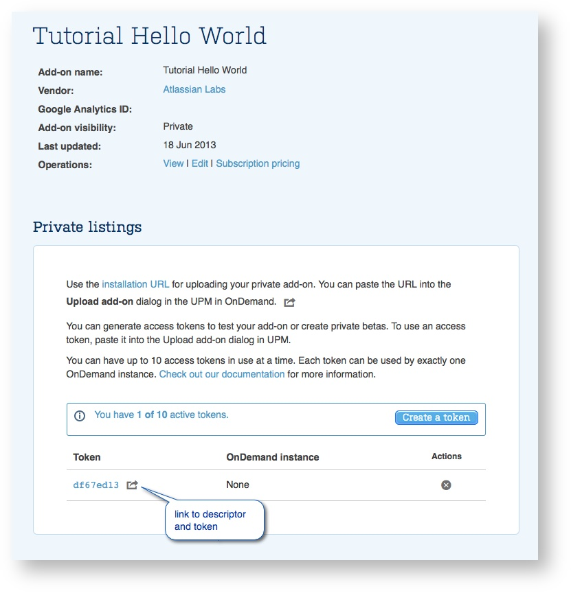

# Installing in the cloud

The [Getting Started](../guides/getting-started.html) tutorial describes how to test an Atlassian
Connect add-on in a local environment. If you followed it, you ran the Atlassian application on a
local machine and installed the add-on manually through a developer mode feature in the Atlassian
application. The next phase in your testing should be to test the add-on in the context of a live
cloud instance.

To do so, create a private listing for your add-on in the [Atlassian Marketplace](https://marketplace.atlassian.com/). 
A Marketplace listing is necessary whether you intend to make the add-on publicly available or just
use it internally. This is because cloud applications only accept add-ons that are installed
through the Marketplace.

## Before starting

    

        
        <strong>Important</strong>
    

    In order to install an add-on into a cloud instance, it must be served over HTTPS. An add-on
    _must_ have a [`baseUrl`](../modules/#baseUrl) which starts with `https://`; a baseUrl of the form
    `http://my-server.com:443/` will not be accepted. Additionally, the HTTPS certificate cannot not be self-signed.

To create a listing, you'll need a Marketplace user account that's associated with a vendor. You can
create a new profile for a vendor when creating the listing, or have your account added to an
existing vendor profile by someone already associated with that profile. To get an account on the
Marketplace, sign up [here](https://id.atlassian.com/profile/signUp.action?application=mpac&continue=https://marketplace.atlassian.com/).

Also, before starting, you will need to have your add-on descriptor file on hand. When creating the
listing, the Marketplace form asks you to upload the file from a directory location.

Add-on vendors can create an environment for testing simply by [trialing](https://www.atlassian.com/try)
a standard cloud application. Before your thirty-day trial expires, send an email to
[developer-relations@atlassian.com](mailto:developer-relations@atlassian.com) and we can change your
instance to use a free developer license.

## Create the listing
With your Marketplace account set up and add-on descriptor on hand, create the Atlassian Connect
listing as follows:

1. Log in to the [Atlassian Marketplace](https://marketplace.atlassian.com/).
2. Click the **Manage Add-ons** link.
3. Click **Create new add-on**.
4. Choose a vendor or, if you don't have a vendor profile yet, click **Create new vendor** to
configure a new vendor profile for your add-on.
5. Choose **Private** as the add-on visibility option. If you intend to use the add-on for
internal-use only, it can remain private for the life of the listing. If you choose to make the
listing public later, you can.
6. Provide the url to your descriptor (`atlassian-connect.json` file).
7. Follow the on-screen instructions to configure the remaining fields and options on the form.
There are a few fields that require a little more explanation for an Atlassian Connect add-on
listing:
	- **Payment Model**: You can only choose paid via Atlassian or free, because Atlassian Connect
add-ons cannot be paid via vendor.
	- **Provide this add-on to**: This field specifies the Atlassian application type targeted by
this add-on. Atlassian Connect add-ons are available to cloud-hosted instances only, so this field is
pre-populated accordingly.
	- **Add-on Details**: Many of the settings under the add-on details heading are optional and
applicable only to public listings. In most cases, you can set these aside for later.
	- **Version Visibility**: While the listing has a visibility setting, so do individual versions
of the add-on published within the listing. This lets you beta test version updates privately,
before publishing them publicly. While different versions of an add-on can have different visibility
settings, note that if you make the listing itself private, all versions of the add-ons also become
private, even if they were previously published as public versions.
	- **My add-on version is a beta release**: Indicates that the add-on version is in the testing
stage only. Select this option if you intend to list the add-on publicly, but it isn't ready yet.
	- **Compatible application**: For an Atlassian Connect add-on, after you choose the product you
are targeting and the minimum version, the **Compatible to** version is uneditable (that is, it defaults to **Any**). 
Because Atlassian Connect add-ons use stable, forward-compatible web APIs and cloud versions are frequently updated, 
the notion of a latest-compatible version is absent for Atlassian Connect add-ons. It is applicable, however, 
to downloadable Java add-ons.
8. Click Submit when done.

You can now generate test license tokens for your add-on and install it in cloud instances,
either through MyAtlassian for live instances, or through the descriptor link of the
listing view for locally running instances. The next section provides more detail on how to do this.

When you finish testing your add-on, developing the marketing material, or wrapping up any other
loose ends, submit your add-on listing for approval, as described in [Selling on the Atlassian
Marketplace](./selling-on-marketplace.html).

## Managing access tokens

Access tokens can be thought of as add-on licenses that you, the add-on developer, can generate and
manage without going through the usual add-on licensing process.

Access tokens let you install and test add-ons that are under development in live cloud
instances. They also let you install and use private add-ons (that is, add-ons intended for an
organization's internal use).

### About access tokens
To create access tokens for an add-on, you first need to create a private listing for it on the
Atlassian Marketplace. You can then use the private listing page of the add-on to generate and
manage tokens.

For paid add-ons, after you install your add-on and apply an access token to it, you can test the
add-on against the various [license states](../concepts/licensing.html) it will encounter in the
real world, such as valid, expired, and unlicensed.

While access tokens are like licenses, a few restrictions apply to access tokens that differentiate
them from licenses. Notably, there can only be ten tokens per add-on. Also, a token is bound to a
particular add-on and cloud instance. After a token is applied to an Atlassian application
instance, it is permanently associated with that instance. You cannot use it on another instance.

Deleting a token invalidates it (and allows you to create another license, if you have reached the
maximum). If an add-on uses a deleted token in an cloud instance, the add-on is then treated as
unlicensed.

You can create a token from the add-on's private listing on the Marketplace or, if you've already
installed the add-on, directly from the Manage add-ons page. If you're generating a token to share
with an external tester, you need to create the token in the Marketplace, as described next.

### Generating an access token from a Marketplace listing
After you create a private listing for an add-on, you can generate an access token it for it from
the listing. To do so, follow these steps:

1. Log in to the Atlassian Marketplace using the credentials associated with your vendor contact account.
2. Click the **Manage Add-on** link.
3. Click on the name of the add-on.
4. Click on the **Private Listings** tab.
5. Scroll down to the listing information section of the page and click the **Create a token** button.
Keep in mind that this button appears only in the manage page for cloud-hosted add-ons. If you do not
see the button on the manage page for your add-on, make sure you have a properly configured listing.

The new token should appear in the list of tokens. From there, you can either apply the token
manually to an add-on (if it's already installed) or use the link for the token to
install the add-on and apply the token at one time (as described next).

The link to the token in the Marketplace (shown in the following screenshot) includes the
installation URL for the add-on along with the access token for it.

Alternatively, you can share this link with external customers or partners for testing.

After creating the token, you can remove it by clicking the delete button.

### Installing add-ons with access tokens
After generating the token, you can use the token URL to install the add-on and apply the token,  as
follows:

1. In the Marketplace listing for the add-on, copy the link for the token you generated.
2. Log into the cloud instance into which you want to install the add-on.
3. Go to the Manage add-ons page in the administration console.
4. Click the Settings link at the bottom of the page, and enable private listing by making sure the
checkbox is enabled.
5. Back in the Manage add-ons page, click **Upload add-on**.
6. Paste the URL of the descriptor from your draft listing and click **Upload**.
7. The add-on manager retrieves the descriptor and installs the add-on, applying the token you
generated to the add-on. When done, the Installed and Ready to go dialog appears.

Now you can test your add-on, modify the license state (if it's a paid-via-Atlassian add-on), or
manage the token. To test it, set the license state to the one you want to test and start testing.

That is, from the **License Status** menu, choose the license state you want to test from the
options listed. You can choose from active trial, active subscription, inactive subscription
(expired), canceled, and so on.

Notice that the usual buttons for managing subscription status for the add-on are now disabled in
the user interface, since the token is the mechanism that serves this function for now.

###Applying a token from the administration console
As an alternative to generating a token from the Marketplace listing, you can generate it directly
from the administration pages of your cloud instance. This would be necessary if you've already
installed the add-on, and want to apply a token for it directly from the Manage add-ons page.

To do so:

1. In the Manage add-ons page in the administration console, enable the private listings in the
Settings dialog.
2. If you haven't already, install the add-on using the descriptor URL from the listing.
3. After installing the add-on, expand the details view for the add-on and click the plus symbol
(+) next to Access token.
4. Log in using an account associated with the Marketplace vendor, and follow the instructions to
generate and apply the token.

To delete a token, click the edit icon next to the token in the add-on view, clear the content and
save. This has the effect of deleting the token in this instance, although it still exists on the
Marketplace listing. You can disable an add-on in the administration console only after you have
removed any tokens it has.
