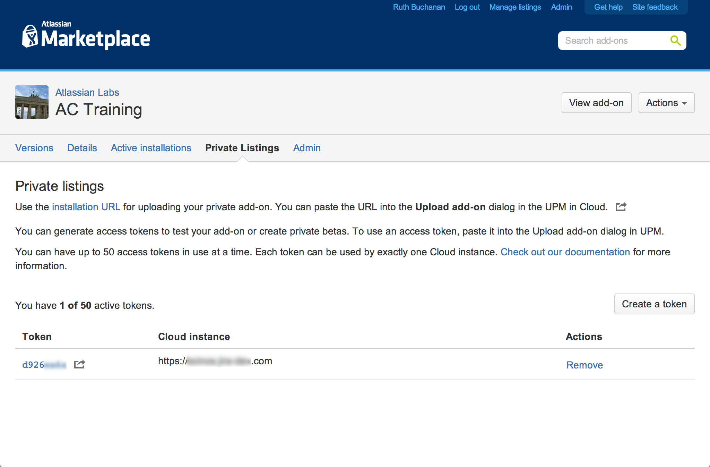

# Installing in the cloud

If you [built a Hello World add-on](../guides/getting-started.html), you ran JIRA Cloud on a local 
machine, and installed your add-on manually through a developer feature in the application. The next 
phase is to test your add-on in the context of a live cloud instance, instead of your local 
machine. 

To do this, you'll need to list your add-on in the [Atlassian Marketplace](https://marketplace.atlassian.com/). This is necessary whether you want to make your add-on available privately or publicly, since cloud 
applications only accept add-ons installed through the Marketplace. 

## Before starting

There are a few prerequisites before you create your Markeptlace listing:

- **Create or get access to a cloud-hosted product instance**  
    You can create an environment for testing simply by [trialing](https://www.atlassian.com/try)
    a standard cloud application. Before your 30-day trial expires, [contact our Developer Relations team](https://developer.atlassian.com/help#contact-us) 
    and we'll change your instance to use a free developer license.

- **Your add-on and your `atlassian-connect.json` descriptor file are served over HTTPS**  
    Your add-on (and your `atlassian-connect.json` descriptor) must be served over HTTPS to be installed into 
    a cloud instance. Your add-on _must_ have a [`baseUrl`](../modules/#baseUrl) that starts with `https://`; 
    a `baseUrl` of the form `http://my-server.com:443/` will not be accepted. Additionally, your HTTPS 
    certificate cannot not be self-signed.

- **You have an [Atlassian user account associated with the Marketplace](https://id.atlassian.com/profile/signUp.action?application=mpac&continue=https://marketplace.atlassian.com/)**    
    You need a Marketplace user account associated with a vendor profile to create a listing. You can create a new 
    vendor profile when you create your listing, or have your account added to an existing profile by somebody already 
    associated with it. To get an account associated with the Marketplace, [sign up here](https://id.atlassian.com/profile/signUp.action?application=mpac&continue=https://marketplace.atlassian.com/). 

## Create the listing
With your Marketplace account set up and add-on descriptor on hand, create the Atlassian Connect
listing as follows:

Now, you can generate test license tokens for your add-on and install it in cloud instances, 
either through MyAtlassian for live instances, or through the descriptor link of the
listing view for locally-running instances. The next section provides more detail on how to do this.  

## Access tokens

If you created a **private** listing in the Marketplace, you can create and use access tokens. 
Access tokens are like licenses that you can generate and manage without going through 
the usual licensing process. Tokens let you install and test add-ons under development in live 
cloud instances. You can also use these licenses to install and use private add-ons if you 
only intend your add-on for internal use. 

If your add-on is paid, after you install your add-on and apply a token, you can test your 
add-on against various [license states](../concepts/licensing.html) like valid, expired, and unlicensed.

### Access token restrictions
While access tokens are _like_ licenses, a few restrictions apply. 

- **10-token limit**  
    Each add-on can only have 10 active tokens at a time. 

- **Token removal**
    You can delete or remove tokens at any time. If you have 10 active tokens, you can remove one 
    to be able to create another. Add-ons in cloud instances with deleted tokens are 
    treated as unlicensed.  

- **No reusability**  
    A token is bound to a particular add-on and cloud instance. After a token is applied to an 
    Atlassian application instance, it is permanently associated with that instance, and 
    can't be used with another.  

### Creating tokens

You can create a token from your add-on's private listing on the Marketplace. If you've already
installed the add-on, you can create tokens directly from the _Manage add-ons_ page. If you're 
generating a token to share with an external tester, you need to create the token in the Marketplace:

#### Generating an access token from a Marketplace listing
After you create a private listing for an add-on, you can generate an access token from
your listing:

1. Log in to the [Atlassian Marketplace](https://marketplace.atlassian.com/).
2. Click the **Manage listings** link.
3. Click the name of your private add-on from the listings page.
4. Click on the **Private listings** tab.
5. Click **Create a token**.  
    This button appears only in the _Manage add-on_ page for private cloud-hosted add-ons. If you don't
    see the button here, make sure your listing is private and cloud-hosted.

New tokens appear in the subsequent list. From here, you can either apply them manually 
to an add-on if it's already installed, or use the link for the token to install the add-on 
and install the add-on at one time. Delete tokens using the **Remove** button.  

The Marketplace token links are installation URLs that include the token. You can share 
this link with external customers or partners for testing. 

### Installing add-ons with access tokens
After generating the token, you can use the token URL to install the add-on and apply the token 
in the same process: 

1. Copy your token link from your _Manage add-on_ page in Marketplace.  
2. Log into the cloud instance where you want to install your add-on.  
3. Go to **Manage add-ons** in the administration console.  
4. Click **Settings** at the bottom of the page.  
5. Check the box to **Enable privsate listings**.  
6. Back in the _Manage add-ons_ page, click **Upload add-on**.  
7. Paste the URL of your descriptor from the Marketplace, and click **Upload**.  
    Your descriptor is retrieved and installed, and your token is applied. You should 
    see an "Installed and ready to go!" dialog.  

Now you can test your add-on, modify its licencse states (if it's paid), or manage the token. 
To test, set the license state to the one you want. From the **License status** menu, choose the 
state you'd like to test – active trial, subscription, inactive subscription, etc.  

The usual options for managing the subscription for your add-on will be disabled in the user 
interface, since the token is the mechanism that serves this function for now.  

###Applying a token from the administration console
You can also generate a token directly from a listing directly in the product like JIRA or Confluence. 
You can do this from the _Manage add-ons_ page in the administration console:  

1. Follow the instructions above to **Enable private listings** from the _Settings_ dialog.  
2. Install the add-on using your HTTPS-hosted `atlassian-connect.json` descriptor URL. 
    Click **Upload add-on** and paste the URL into the corresponding field. 
3. After installing the add-on, expand the details view for the add-on.  
4. Click the **plus (+) symbol** next to _Access token_.  
5. Log in using an account associated with your Marketplace vendor profile.  
6. Follow the in-app directions to generate and apply the token.  

If you need to delete a token from an add-on, click the edit icon next to the token in the add-on view, 
and clear the content and save. This deletes your token in the instance, although it still exists on the
Marketplace listing. You can disable an add-on in the administration console after you have
removed its token.  

