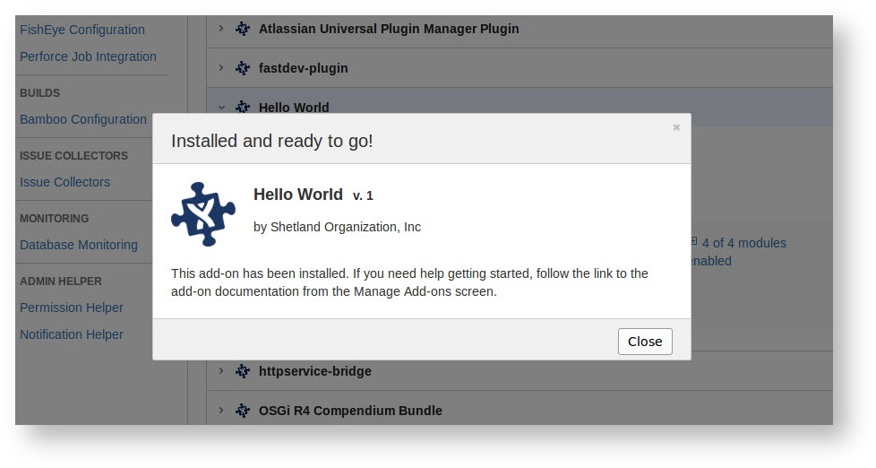

# Local add-on development

Most add-on developers will go through three phases during development: developing with a local version of the
Atlassian product, testing with a cloud instance, and finally making the add-on available to your customers
 (whether the customer is just you or you intend to distribute it to the public).

This document explains how you would go about developing your add-on with a local copy of the Atlassian product.
[Installing in the cloud](./cloud-installation.html) explains how to use private Marketplace listings to test in
cloud instances, and [Selling on  Marketplace](./selling-on-marketplace.html) explains how to release your add-on to the
public.

## Step 1. Start the local Atlassian application

The easiest way to get a local instance of the Atlassian application is by using the
[Atlassian Plugins SDK](https://developer.atlassian.com/display/DOCS/Downloads).

The SDK is the development kit used to create Java-based plugins for the Atlassian download products. While you
don't need the plugin building capabilities of the SDK, you can use its features for downloading,
installing and starting Atlassian applications.

We recommend you start the host application using the SDK command shown here. Atlassian Connect is only present in
Atlassian cloud products and not yet included with locally-hosted server distributions of our software. Therefore certain 
components, including the Atlassian Connect Framework itself, are included here in the startup command. Without 
these components present, Connect add-ons cannot be installed. If you are not using the commands below, ensure 
all of the components listed in the `--bundled-plugins` argument are present in your Atlassian application.

You can start JIRA or Confluence Cloud with Atlassian Connect as follows:

### Stable versions

Starting the applications requires you to specify a number of hard-coded component version numbers as shown. This
includes the version of Atlassian Connect framework. Those component versions will change as Atlassian Connect
development continues. To find out about new version updates, subscribe to the Atlassian Connect
[mailing list](https://groups.google.com/forum/?fromgroups=#!forum/atlassian-connect-dev), and keep your eye on
Atlassian Connect [release notes](https://developer.atlassian.com/static/connect/docs/resources/release-notes.html).

To start a local JIRA/Confluence server with Connect matching what is currently in production in Atlassian Cloud, run:

#### JIRA

Loading...

#### Confluence

Loading...

### Bleeding edge

	    

	        
	        <strong>Experts only!</strong>
	    

		
This is using the latest development version of Connect, so you can test the latest and greatest,
		and as such may be unstable.

To start a local JIRA/Confluence server with the latest development version of Connect (bleeding edge), run:

#### JIRA

Loading...

#### Confluence

Loading... 

## Step 2. Start your add-on

Start your add-on application. The options for hosting your add-on are many, but when working on a locally hosted
environment, you can use any web framework / server you wish to build your add-on.

For an example of using the simple HTTP server, see the [getting started](../guides/getting-started.html) guide.

## Step 3. Register your add-on

Registering your add-on installs it in the Atlassian application. After installation, the add-on appears in the list of
user-installed add-ons in the [Manage Add-ons](https://confluence.atlassian.com/display/UPM/Universal+Plugin+Manager+Documentation)
page in the administration console and its features are present in the application UI.

You can install an add-on with the UPM as follows. Note, these instructions were written for UPM version 2.14 or later.

1. Log in to the Atlassian application interface as an admin or a system administrator. If you
started the application with Atlassian's SDK, the  default username/password combination is admin/admin.
2. Choose  > __Add-ons__ from the menu.
The Administration page will display.
3. Choose the __Manage add-ons__ option.
4. Scroll to the page's bottom and click the __Settings__ link. The __Settings__ dialog will display.
5. Make sure the "Private listings" option is checked and click __Apply__.
6. Scroll to the top of the page and click the __Upload Add-on__ link.
7. Enter the URL to the hosted location of your plugin descriptor. In this example, the URL is
similar to the following:  `http://localhost:8000/atlassian-connect.json`. (If you are installing
to a cloud instance, the URL must be served from the Marketplace, and will look like `https://marketplace.atlassian.com/download/plugins/com.example.add-on/version/39/descriptor?access-token=9ad5037b`)
8. Press __Upload__. The system takes a moment to upload and register your plugin. It displays the
__Installed and ready to go__ dialog when installation is complete. 
9. Click __Close__.
10. Verify that your plugin appears in the list of __User installed add-ons__. For example, if you
used Hello World for your plugin name, that will appears in the list.

## Step 4. Test your add-on

The exact steps for testing will vary based on what your add-on does, of course. However, there are some common minimal
steps applicable to any add-on for ensuring that it got installed correctly.

After registering your add-on in the Atlassian application, it should appear in the UPM as a user-installed add-on. Any
UI features you have declared with modules should now be visible as well.

## Step 5. Change your code and reload

You can now change and reload your add-on as normal for your app or framework. Changes should show up immediately.
(Watch out for browser caching!)

You only need to re-register the add-on when you change the descriptor file, such as when modifying or adding module
declarations, scopes or changing the plugin-info details. Simply repeat step 3.

You should not need to restart the Atlassian application while developing.

## Handy tools

The following tools can be of great help when implementing add-ons!
<table class='aui'>
	<thead>
		<th>Tool</th>
		<th>Description</th>
	</thead>
	<tr>
		<td>[JSON descriptor validator](https://atlassian-connect-validator.herokuapp.com/validate)</td>
		<td>This validator will check that your descriptor is syntactically correct. Just paste the JSON content 
			of your descriptor in the "descriptor" field, and select the Atlassian product you want to validate 
			against.</td>
	</tr>
	<tr>
		<td>[JWT decoder](http://jwt-decoder.herokuapp.com/jwt/decode)</td>
		<td>An encoded JWT token can be quite opaque. You can use this handy tool to decode JWT tokens and inspect 
			their content. Just paste the full URL of the resource you are trying to access, including the JWT
			token, in the URL field. E.g. http://localhost:2990/jira/path/to/rest/endpoint?jwt=token</td>
	</tr>
</table>

