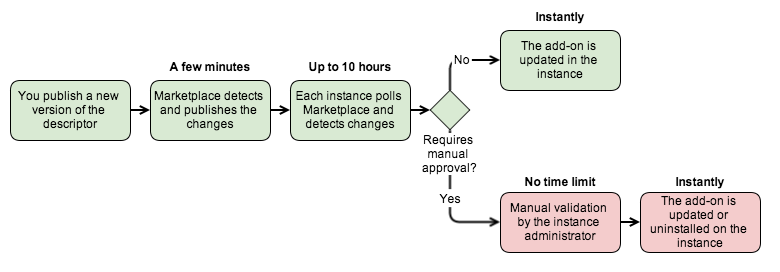
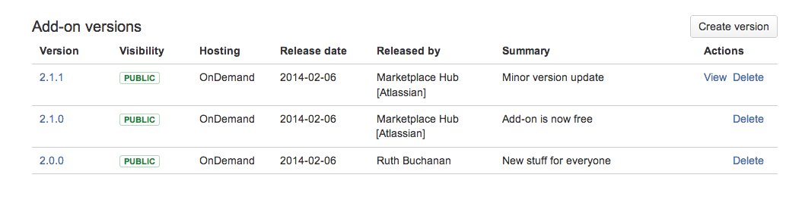

# Upgrading and versioning your add-on

You can upgrade your add-on any time once it's listed in the [Marketplace](https://marketplace.atlassian.com/) as either
an [approved public add-on](./selling-on-marketplace.html) or a [private listing](./cloud-installation.html).

Almost all changes you make to your add-on will be to code inside your add-on's web app. For example, tweaking the look
of a web panel, adding a configuration option or catching a previously unhandled exception can all be done by writing
and deploying new code to your servers. Users see these changes as soon as you update your web app. In many cases (e.g.
catching an exception or adding a configuration option) there isn't an immediate reason why end users should be aware of
the change. When you change your [descriptor file](../modules/), we automatically update your version and build number
in the Marketplace.

##Automatic add-on polling & versioning  
We automatically detect updates to Atlassian Connect add-on descriptors with a polling service. This way, you can easily release
fixes and new features without having to manually create new version entries in the Marketplace. We want to ensure that
customers get the latest version of your add-on with as little delay as possible – Connect add-ons should seem like web
services, not versioned software.

When you change your add-on descriptor, these changes are automatically deployed to customer instances within a few hours 
- unless they [require manual customer approval](#manual-approval). Here's how it works:

###Automatic updates

If the changes do not require manual customer approval, they are automatically deployed to all customer instances 
**within 10 hours**: 

* We poll the add-on descriptor URL that you included when you submitted your listing. When we detect a change, we 
automatically update your add-on in the Atlassian Marketplace with a new version. Updates are published to the Marketplace 
within a few minutes of you publishing changes to your [descriptor file](../modules/). 
* Each customer instance polls the Atlassian Marketplace periodically (currently every 6 hours) and automatically 
updates to the latest version of your add-on. 
* If you change your add-on during the 
[maintenance windows](https://confluence.atlassian.com/x/aJALE), 
the upgrade of your add-on on customer instances could be further delayed by 4 hours. We use the 
[this blog](https://confluence.atlassian.com/pages/viewrecentblogposts.action?key=AOD) 
to announce upcoming upgrades and their completion. 

**Note**: Our polling service uses user-agent **`Marketplacebot`**. You can search for this user-agent in your access logs to
distinguish normal traffic from our polling service.

### Changes that require manual customer approval  

Even though your add-on is automatically updated in the Marketplace, certain scenarios require customers to manually
approve your add-on's update in the [UPM](https://confluence.atlassian.com/x/_AJTE). We automatically send emails to the
product administrator so they can approve and update the add-on.

These scenarios require manual customer approval:  

* Your listing changes from __free to paid__: Your change triggers a Marketplace approval. Existing customers need to
approve the change to start paying for your add-on, otherwise they will need to uninstall it. 
* Your listing involves __additional [scopes](../scopes/scopes.html)__: Marketplace updates happen automatically, 
but customers need to approve the changes before the add-on is updated. 

In both cases, customers continue using the old version of the add-on until administrators approve the changes, or 
rejects them.

### What this means for your add-on

If the new version of your add-on is backward compatible, in other words if it is able to handle requests from instances who
have an older version of the descriptor, the upgrade will be transparent. All customer instances will be upgraded over a 
period of **up to 10 hours**.

However if the new version of your add-on is not backward compatible, you should make sure that your solution caters for 
supporting both the old and the new version of the add-on:

* For up to 10 hours (or a day to be safe) if the changes do not require manual customer approval.
* If the changes require customer approval, until administrators for all instances have approved/rejected the changes, or 
you decide to retire the old version of your add-on.

##Major, minor, and micro version update definitions  

We automatically build a version identifier for your add-on. How we increment your version number depends on the changes
detected in your descriptor file. For example:

*  __Major version__ (`1.2.3` to `2.0.0`): [API version updates](../modules/#apiVersion) increment your major version. The
major version matches the API version listed in your descriptor.
* __Minor version__ (`1.2.3` to `1.3.0`): Increase or changes in scope, _and/or_ a transition from a free to paid model.
Customers must manually approve updates for minor version updates.
* __Micro version__ (`1.2.3` to `1.2.4`): Any descriptor changes not included above that do _not_ require manual approval.

## Viewing automatically added versions  

You can view add-ons in the Marketplace the same way you manage other add-on versions:  

1. Log in with your vendor credentials.
2. Click __Manage add-ons__ from the header.
3. Click your add-on's name from the list.
4. Click __Versions__ in the horizontal navigation bar.

You'll see updates from _Marketplace Hub [Atlassian]:_  

  

