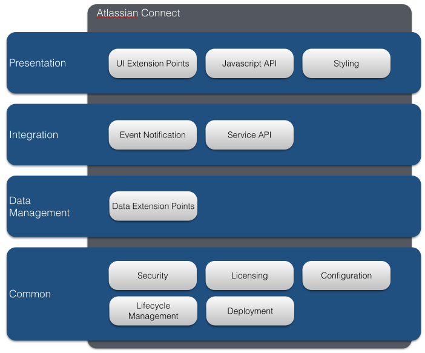

# The Components of Atlassian Connect
Now that you have read the [introduction](../guides/introduction.html) and understand what Connect is in a nutshell, this section provides 
you with the list of components provided by Connect. This can help you navigate the documentation.

<table class="aui">
		<tr>
			<td>**Category**</td>
			<td>**Component**</td>
			<td>**Description**</td>
			<td>**Documentation**</td>
		</tr>
		<tr>
			<td>Common</td>
			<td>Security</td>
			<td>Atlassian Connect leverages JWT - JSON Web Token - to 
				secure communications through service API calls and event notifications, allows add-ons to request access to a set of static scopes, 
				and administrators to limit the data a particular add-on can access. Security is an important topic in Atlassian Connect, and we 
				recommend you spend time reviewing this documentation to understand  what Connect provides and what the reponsibilities 
				of your add-on are. </td>
			<td>[Security](../concepts/security.html), [Authentication](../concepts/authentication.html), 
				[Understanding JWT](../concepts/understanding-jwt.html)</td>
		</tr>
		<tr>
			<td>Common</td>
			<td>Licensing</td>
			<td>Any add-on intended for sale on the Atlassian Marketplace needs to be license-enabled. Add-ons work with the atlassian
				application to apply licensing requirements.</td>
			<td>[Licensing](../concepts/licensing.html)</td>
		</tr>
		<tr>
			<td>Common</td>
			<td>Configuration</td>
			<td>Most configuration for an add-on resides in an add-on descriptor file, which describes the add-on to the Atlassian application. 
				It is where you will specify the user interface modules the add-on extends, register interests to particular events (webhooks 
				or lifecycle notifications), specify the security scopes the add-on needs to function properly, etc. Make sure you know  
				the structure of this descriptor like the back of your hand!</td>
			<td>[Add-on Descriptor](../modules/)</td>
		</tr>
		<tr>
			<td>Common</td>
			<td>Lifecycle Management</td>
			<td>When your add-on is first installed in an Atlassian product instance, Connects notifies your implementation through a callback 
				endpoint that you provide, providing you with information on the instance and the security context you must store for future 
				communications. You will also receive a notification when your add-on is uninstalled or disabled.</td>
			<td>[Lifecycle](../modules/lifecycle.html)</td>
		</tr>
		<tr>
			<td>Common</td>
			<td>Deployment</td>
			<td>You can deploy your add-on on a local version of the Atlassian product for development, on a dedicated OnDemand instance for testing, 
				and then make the add-on available to your customers via Marketplace.</td>
			<td>[Developing locally](../developing/developing-locally.html), [Installing in OnDemand](../developing/installing-in-ondemand.html), 
				[Selling on MarketPlace](../developing/selling-on-marketplace.html)</td>
		</tr>
		<tr>
			<td>Integration</td>
			<td>Event Notification</td>
			<td>Your add-on may register interest to particular events and provide a callback endpoint which will be invoked by the 
				Atlassian product when a matching event is triggered. Some of the events you can subscribe to are product specific
				(e.g. an issue was updated in JIRA triggers), and in this case you should read sections about Webhooks (the underlying 
				event mechanism), others are linked to the lifecyle of your add-on (e.g. the add-on was installed on a particular instance).</td>
			<td>[Add-on Lifecycle](../modules/lifecycle.html), 
				[JIRA Webhooks](../modules/jira/webhooks.html), 
				[JIRA Workflow Post Function](../modules/jira/workflow-post-function.html), 
				[Confluence Webhooks](../modules/confluence/webhooks.html)</td>
		</tr>
		<tr>
			<td>Integration</td>
			<td>Service API</td>
			<td>Your add-on can invoke services exposed by Atlassian products using a variety of technologies (REST, JSON-RPC, SOAP, XML-RPC) 
				in a secured manner, using a server-to-server call, or using the Javascript API directly in a user interface page. Note that 
				parts of the API are public (stable) with guaranteed backward compatibility, while other parts are private - we do not guarantee 
				their backward compatibility. Before you choose the technologies you want to use to talk to Atlassian products, make sure you review 
				their respective documentation, as some of them may be deprecated. In doubt, choose REST!</td>
			<td>[JIRA REST](../scopes/jira-rest-scopes.html), 
				[JIRA JSON-RPC](../scopes/jira-jsonrpc-scopes.html), 
				[JIRA SOAP](../scopes/jira-soap-scopes.html), 
				[Confluence REST](../scopes/confluence-rest-scopes.html), 
				[Confluence JSON-RPC](../scopes/confluence-jsonrpc-scopes.html), 
				[Confluence XML-RPC](../scopes/confluence-xmlrpc-scopes.html)</td>
		</tr>
		<tr>
			<td>Data Management</td>
			<td>Data Extension Points</td>
			<td>Your add-on is responsible for storing all data for any custom fields it requires. The only exception to this rule is the concept 
				of JIRA Entity Property, allowing add-ons to add key/value stores to JIRA entities, such as issues or projects.</td>
			<td>[JIRA Entity Property](../modules/jira/entity-property.html)</td>
		</tr>
		<tr>
			<td>Presentation</td>
			<td>User Interface Modules</td>
			<td>Connect enables you to extend the user interface provided by Atlassian products
				through a number of modules (Admin page, web item, web panel, etc.), specific to each product.
				Your add-on pages are loaded seemlessly within iframes in the user's browser.</td>
			<td>[JIRA Module List](../modules/jira/index.html), 
				[Confluence Module List](../modules/confluence/index.html)</td>
		</tr>
		<tr>
			<td>Presentation</td>
			<td>Javascript API</td>
			<td>When building new UI modules, you can leverage the Javascript API provided by Connect to share
				data between iframes, invoke a REST API exposed by an Atlassian product, and debug your implementation.</td>
			<td>[Javascript API](../concepts/javascript-api.html)</td>
		</tr>
		<tr>
			<td>Presentation</td>
			<td>Styling</td>
			<td>The Atlassian User Interface Library (AUI) is the framework that Atlassian uses to build our products. 
				AUI is a library of Javascript, CSS, templates and other resources you can include in your projects. 
				Building a user interface with AUI automatically ensures your add-on will match its target application's user interface.</td>
			<td>[Styling Add-ons with AUI](../concepts/styling-with-aui.html)</td>
		</tr>		
</table>

On top of these core components, Atlassian also provides support for client frameworks, libraries and utilities, which help you during 
development and can help you take care of the plumbing. 
You do not have to use them - Connect lets you choose your own technologies - but they can be really handy if you are starting from scratch:

<table class="aui">
	<tr>
		<td>**Tool**</td>
		<td>**Language**</td>
		<td>**Description**</td>
	</tr>
	<tr>
		<td>[atlassian-connect-play-java](https://bitbucket.org/atlassian/atlassian-connect-play-java)</td>
		<td>Java with Play2</td>
		<td>Client framework - automatically deploys code changes for testing; support for JWT, multi-tenancy, calls to the host application, etc.</td>
	</tr>	
	<tr>
		<td>[atlassian-jwt](https://bitbucket.org/atlassian/atlassian-jwt)</td>
		<td>Java</td>
		<td>Support for creating, decoding and validating JWT tokens, for any Java implementation.</td>
	</tr>
	<tr>
		<td>[atlassian-connect-express](https://bitbucket.org/atlassian/atlassian-connect-express)</td>
		<td>Node.js</td>
		<td>Client framework - automatically deploys code changes for testing, support for JWT, multi-tenancy, etc.</td>
	</tr>
	<tr>
		<td>[REST API Browser](http://localhost:9000/rest-apis/product-api-browser.html)</td>
		<td>N/A</td>
		<td>The REST API Browser will help you get acquainted with the available APIs exposed by Atlassian products.</td>
	</tr>
</table>

