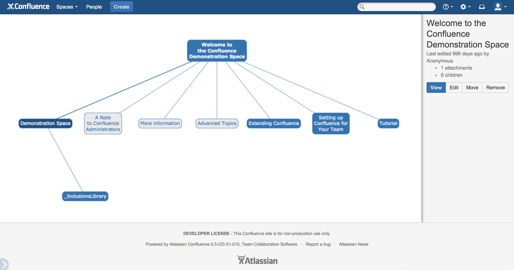
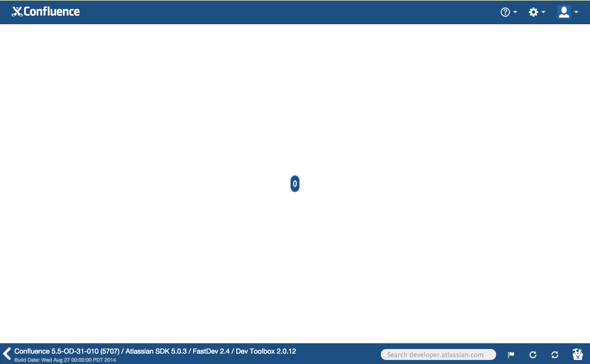
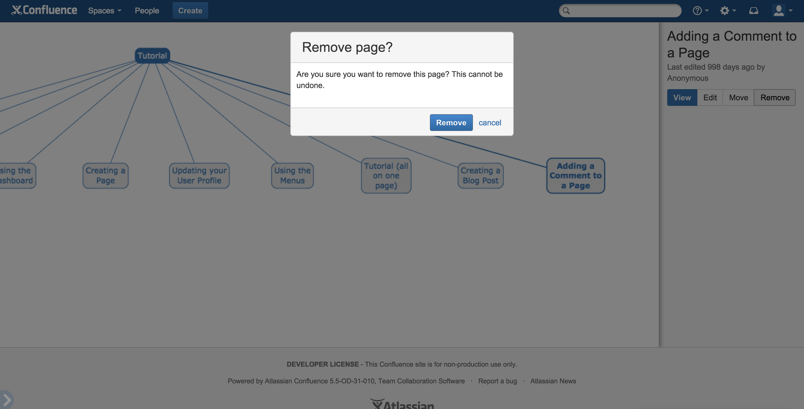

##Tutorial: Manage your Confluence instance

        

            
            <strong>Who this tutorial is for</strong>
        

        

        You can complete this tutorial even if you've never built an Atlassian add-on before. You'll
        need at least version 4.2.20 of the [Atlassian SDK installed](https://developer.atlassian.com/display/DOCS/Downloads).
        

In this tutorial, you'll learn about:

* [Configuring your development environment](#environment)
* [Hosting your add-on locally](#hosting-locally)
* [Implement a Confluence REST API client](#rest-api)
* [Display a full-screen dialog](#dialog)

This tutorial shows you how to build a static Connect add-on that displays page hierarchy in a Confluence space. This 
add-on is handy to query, update, and delete Confluence pages. You'll also create a full-screen confirmation dialog
displaying content from your add-on.  

Your add-on will use the <a href="https://docs.atlassian.com/confluence/REST/latest/" target="_blank">
Confluence REST API </a>. At completion, your add-on will look a lot like this: 

##  Set up your development environment

This step confirms your development environment is configured correctly. You'll need <a href="http://git-scm.com/" 
target="_blank">Git</a>, <a href="http://nodejs.org/" target="_blank">Node.js</a>, and the 
[Atlassian SDK installed](https://developer.atlassian.com/display/DOCS/Downloads). 

The Atlassian Plugin SDK provides a command toolkit vital for developing Atlassian add-ons.
To run Confluence Gardener, you'll use a one of these commands, 
[`atlas-run-standalone`](https://developer.atlassian.com/display/DOCS/atlas-run-standalone), which runs a copy of 
an Atlassian product on your machine.

Once you have all the prerequisites, you'll clone an existing repository to kick things off.  

<a data-replace-text="Hide Git installation instructions [-]" class="aui-expander-trigger" aria-controls="install-git">Show Git installation instructions [+]</a>

    

<a data-replace-text="Hide Node.js instructions [-]" class="aui-expander-trigger" aria-controls="install-node">Show Node.js instructions [+]</a>

    

<a data-replace-text="Hide SDK instructions [-]" class="aui-expander-trigger" aria-controls="install-sdk">Show SDK instructions [+]</a>

    

1. Clone the Confluence Gardener repository. 
    <pre><code data-lang="text">$ git clone https://bitbucket.org/atlassianlabs/confluence-gardener.git</code></pre>
1. Change into your new `confluence-gardener` directory.  
    <pre><code data-lang="text">$ cd confluence-gardener</code></pre>
1. Start Confluence in cloud mode from your `confluence-gardener` directory. 
    Loading...
    You'll see a lot of output. When finished, your terminal will notify you that Confluence started successfully:
    <pre>
    [INFO] [talledLocalContainer] Tomcat 6.x started on port [1990]
    [INFO] Confluence started successfully in 116s at http://localhost:1990/confluence
    [INFO] Type Ctrl-D to shutdown gracefully
    [INFO] Type Ctrl-C to exit
    </pre>
1. Navigate in your browser to your fresh Confluence instance, usually at <a href="http://localhost:1990/confluence" target="_blank">http://localhost:1990/confluence</a>. 
1. Log in as an administrator:   
    __Username__: `admin`  
    __Password__: `admin`    

##  Host & install your add-on

Confluence Gardener is a static Connect add-on that you can host with a simple web server. You'll use a simple 
Node.js-powered server to host your add-on locally. 

After you've spun up your server, you'll install your copy of Gardener to Confluence. You'll use a Bash script 
included in the repo you cloned to install the add-on.   

1. From the `confluence-gardener` directory, start your server on port 8000:
    

1. In your browser, navigate to your descriptor file at <a href="http://localhost:8000/atlassian-connect.json" 
    target="_blank">http://localhost:8000/atlassian-connect.json</a>  

    <a data-replace-text="Hide atlassian-connect.json [-]" class="aui-expander-trigger" aria-controls="complete-descriptor">Show atlassian-connect.json [+]</a>

    

    <pre><code data-language="javascript">
    {
        "key": "confluence-gardener",
        "name": "Confluence Gardener",
        "description": "Prune back your Confluence page graph.",
        "baseUrl": "http://localhost:8000",
        "vendor": {
            "name": "Atlassian Labs",
            "url": "https://www.atlassian.com"
        },
        "authentication": {
            "type": "none"
        },
        "version": "0.1",
        "modules": {
            "generalPages": [
                 {
                     "key": "gardener",
                     "url": "/index.html?spaceKey={space.key}",
                     "location": "system.content.action",
                     "name": {
                         "value": "Confluence Gardener"
                     }
                 }
             ]
        },
        "scopes": [
            "read",
            "write",
            "delete"
        ]
    }
    </code></pre>

1. In a new terminal window, run the `install-confluence-gardener.sh` script. 
    <pre><code data-lang="text">$ ./install-confluence-gardener.sh</code></pre>  
    Alternatively, you can install Gardener using the <a href="https://confluence.atlassian.com/x/8AJTE" target="_blank">Universal Plugin Manger (UPM)</a>.  
    <a data-replace-text="Hide UPM installation instructions [-]" class="aui-expander-trigger" aria-controls="upm-instructions">Expand UPM installation instructions [+]</a>

    

        <h3>Set the Confluence Base URL</h3>

        <ul>
            <li>Navigate to <a href="http://localhost:1990/confluence/admin/editgeneralconfig.action" target="_blank">http://localhost:1990/confluence/admin/editgeneralconfig.action</a>.</li>
            <li>Set your `Server Base URL` field to `http://localhost:1990/confluence`.</li>
            <li>Click <b>Save</b>.</li>
        </ul>

        <h3>Install Gardener</h3>

        <ul>
            <li>Navigate to http://localhost:1990/confluence/plugins/servlet/upm</li>
            <li>Click <b>Upload add-on</b>.</li>
            <li>Enter <tt>http://localhost:8000/atlassian-connect.json</tt></li>
            <li>Click <b>Upload</b>.</li>
        </ul>
    

    Gardener doesn't have functionality yet (you'll implement that in future steps), but feel free to try to load it anyway. 
1.  Browse to the Demonstration space at <a href="http://localhost:1990/confluence/display/ds" 
    target="_blank"> http://localhost:1990/confluence/display/ds</a>.
1. Click <b>Tools</b> at the top right, and choose <b>Confluence Gardener</b>.  
    You should see a page like this: 
    

Now you're ready to start developing functionality for your Gardener add-on. 

##  Implement a Confluence REST API client

All the functions that request data from Confluence are in your `js/data.js` file. The functions are incomplete, 
so in this step you'll flesh these out. 

You'll use the [Confluence REST API browser](https://bunjil.jira-dev.com/wiki/plugins/servlet/restbrowser) and
the [AP.request documentation](/static/connect/docs/javascript/module-request.html) to implement functions to get 
page and space hiearchy in Confluence, and add Gardener functionality to move and remove pages. 

1. Open the `js/data.js` file from your `confluence-gardener` source code.
    You should see the stub code below:  
    <pre><code data-lang="javascript">
    define(function() {
        return {
            getPageContentHierarchy: function(pageId, callback) {
            },

            getSpaceHierarchy: function(spaceKey, callback) {
            },

            removePage: function(pageId, callback) {
            },

            movePage: function(pageId, newParentId, callback) {
            },

            movePageToTopLevel: function(pageId, spaceKey, callback) {
            }
        }
    });
    </code></pre> 
1. Implement `getPageContentHierarchy` to get the page hierachy in your Confluence instance:
    <pre><code data-lang="javascript">
            getPageContentHierarchy: function(pageId, callback) {
                AP.request({
                    url: "/rest/prototype/1/content/" + pageId + ".json?expand=children",
                    success: callback
                });
            },
    </code></pre>
1.  Next, implement `getSpaceHierarchy` to see the space hierarchy: 
    <pre><code data-lang="javascript">
            getSpaceHierarchy: function(spaceKey, callback) {
                AP.request({
                    url: "/rest/prototype/1/space/" + spaceKey + ".json?expand=rootpages",
                    success: callback
                });
            },
    </code></pre>  
1. Implement `removePage` so your add-on can effectively delete Confluence pages: 
    <pre><code data-lang="javascript">
            removePage: function(pageId, callback) {
                AP.request({
                    url: "/rpc/json-rpc/confluenceservice-v2/removePage",
                    contentType: "application/json",
                    type: "POST",
                    data: JSON.stringify([pageId]),
                    success: callback
                });
            },
    </code></pre>
1. Finally, try to implement `movePage` and `movePageToTopLevel` on your own. 
    If you get stuck, expand the example below.  
    
    <a data-replace-text="Hide working implementation [-]" class="aui-expander-trigger" aria-controls="working-data-implementation">Show working implementation [+]</a>

    

    <pre><code data-lang="javascript">
    define(function() {
        return {
            getPageContentHierarchy: function(pageId, callback) {
                AP.request({
                    url: "/rest/prototype/1/content/" + pageId + ".json?expand=children",
                    success: callback
                });
            },

            getSpaceHierarchy: function(spaceKey, callback) {
                AP.request({
                    url: "/rest/prototype/1/space/" + spaceKey + ".json?expand=rootpages",
                    success: callback
                });
            },

            removePage: function(pageId, callback) {
                AP.request({
                    url: "/rpc/json-rpc/confluenceservice-v2/removePage",
                    contentType: "application/json",
                    type: "POST",
                    data: JSON.stringify([pageId]),
                    success: callback
                });
            },

            movePage: function (pageId, newParentId, callback) {
                AP.request({
                    url: "/rpc/json-rpc/confluenceservice-v2/movePage",
                    contentType: "application/json",
                    type: "POST",
                    data: JSON.stringify([pageId, newParentId, "append"]),
                    success: callback
                });
            },

            movePageToTopLevel: function(pageId, spaceKey, callback) {
                AP.request({
                    url: "/rpc/json-rpc/confluenceservice-v2/movePageToTopLevel",
                    contentType: "application/json",
                    type: "POST",
                    data: JSON.stringify([pageId, spaceKey]),
                    success: callback
                });
            }
        }
    });
    </code></pre>
    

##  Display a full-screen dialog

Having implemented all of the REST Client functions, you can now feel free to click around and explore Confluence
 Gardener. However you may have noticed that the remove button doesn't work. Let's make it display [a full-screen
 dialog](https://developer.atlassian.com/static/connect/docs/javascript/module-Dialog.html) now.

### Declare the Dialog in the atlassian-connect.json descriptor file.

Full-screen dialogs are fully-fledged AUI Dialogs which exist in the parent frame (that is, not in the iframe
Confluence Gardener displays in). This AUI Dialog itself contains an iframe which refers back to a web page your add-on
hosts. We've created the HTML of that page for you, but we need to reference it in the atlassian-connect.json
descriptor.

In your editor, open `atlassian-connect.json` and add the following snippet after the `generalPages` entry
in the `modules` object and re-install the add-on using [the method you used above](#installing).

This registers a new [`webItem`](https://developer.atlassian.com/static/connect/docs/modules/jira/web-item.html) which
  will load inside the full-screen Dialog.

<pre><code data-language="javascript">
"webItems": [
    {
        "key": "gardener-remove-dialog",
        "url": "/remove-page-dialog.html",
        "location": "system.top.navigation.bar",
        "weight": 200,
        "context": "addon",
        "target": {
            "type": "dialog",
            "options": {
                "width": "234px",
                "height": "324px"
            }
        },
        "name": {
            "value": "dialog"
        }
    }
]
</code></pre>

<a data-replace-text="Hide atlassian-connect.json [-]" class="aui-expander-trigger" aria-controls="complete-descriptor">Show atlassian-connect.json [+]</a> with the dialog `webItems` entry.

<pre><code data-language="javascript">
{
    "key": "confluence-gardener",
    "name": "Confluence Gardener",
    "description": "Prune back your Confluence page graph.",
    "baseUrl": "http://localhost:8000",
    "vendor": {
        "name": "Atlassian Labs",
        "url": "https://www.atlassian.com"
    },
    "authentication": {
        "type": "none"
    },
    "version": "0.1",
    "modules": {
    "generalPages": [
         {
             "key": "gardener",
             "url": "/index.html?spaceKey={space.key}",
             "location": "system.content.action",
             "name": {
                 "value": "Confluence Gardener"
             }
         }
     ],
     "webItems": [
         {
             "key": "gardener-remove-dialog",
             "url": "/remove-page-dialog.html",
             "location": "system.top.navigation.bar",
             "weight": 200,
             "context": "addon",
             "target": {
                 "type": "dialog",
                 "options": {
                     "width": "234px",
                     "height": "324px"
                 }
             },
             "name": {
                 "value": "dialog"
             }
         }
     ]
    },
    "scopes": [
        "read",
        "write",
        "delete"
    ]
}
</code></pre>

### Implement a function to display the Remove page dialog

Open the `removePageDialog.js` file in your editor. You will see another empty function:

<pre><code data-lang="javascript">
define(function() {
    return function (deleteCallback) {
    }
});
</code></pre>

The returned anonymous function performs needs to perform three small tasks:

1. Load the [`dialog`](https://developer.atlassian.com/static/connect/docs/javascript/module-Dialog.html)
and [`events`](https://developer.atlassian.com/static/connect/docs/javascript/module-Events.html) modules using `AP.require`.

1. Unsubscribe from any previous `confirmPageRemoval` event bindings
1. Subscribe to the `confirmPageRemoval` using the provided `deleteCallback` function as the listener.

Go ahead and try to implement the function. If you get stuck you can expand a working implementation below.

### Working implementation of `removePageDialog.js`

<a data-replace-text="Hide removePageDialog.js [-]" class="aui-expander-trigger" aria-controls="complete-remove-dialog">Show removePageDialog.js [+]</a>

<pre><code data-lang="javascript">
define(function() {
    return function(deleteCallback) {
        AP.require(["dialog", "events"], function (dialog, events) {
            dialog.create({
                key: 'gardener-remove-dialog',
                width: "400px",
                height: "80px",
                header: "Remove page?",
                submitText: "Remove",
                cancelText: "cancel",
                chrome: true
            });

            events.offAll("confirmPageRemoval");
            events.on("confirmPageRemoval", deleteCallback);
        });
    }
});
</code></pre>

That's it! Feel free to play around with the other portions of Confluence Gardener.