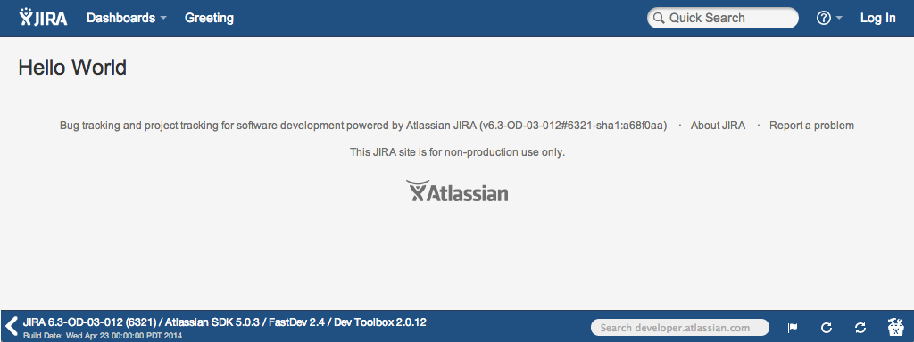

# Getting Started

This Hello World tutorial shows you a basic preview of the Connect framework. Connect add-ons are essentially web applications that integrate with your Atlassian product. In this tutorial, you'll turn a simple web application into an Atlassian Connect add-on. You'll install it in a locally-running copy of JIRA in OnDemand mode, and access your add-on from a link in the header. Your add-on displays as an iframe of your web application. 

Here's what you'll accomplish: 

* [Create a basic `atlassian-connect.json` descriptor](#descriptor)  
* [Build an add-on web application: A super simple HTML page](#webapp)  
* [Start up a locally-running copy of JIRA in OnDemand mode](#runjira)  
* [Install and test your add-on](#install)

By the end, you'll see your web application displayed in an iframe inside of JIRA:  



__Note__: This is a beginner tutorial. You can build this add-on even if you've never built one before. You'll need the [Atlassian SDK](https://developer.atlassian.com/display/DOCS/Downloads) installed and ready to go before you start.


## <a name="descriptor"></a>Create the add-on descriptor (`atlassian-connect.json`)

In this step you'll create a JSON descriptor file. This file describes your add-on to the Atlassian application, which in this case is JIRA OnDemand. Your descriptor specifies your add-on's key, name, permissions needed to operate, and the different modules it uses for integration. 

Your `atlassian-connect.json` file will use a `generalPages` module, and add a link to JIRA's top navigation element titled "Greeting".

1. Create a project directory for your add-on source files.  
    You'll work in this directory for the duration of this tutorial.
2. In your project directory, create a new file named `atlassian-connect.json`.
3. Add the following text to the file:
```
    {
        "name": "Hello World",
        "description": "Atlassian Connect add-on",
        "key": "com.example.myaddon",
        "baseUrl": "http://localhost:8000",
        "vendor": {
            "name": "Example, Inc.",
            "url": "http://example.com"
        },
        "authentication": {
            "type": "none"
        },
        "version": "1.0",
        "modules": {
            "generalPages": [
                {
                    "url": "/helloworld.html",
                    "key": "hello-world",
                    "name": {
                        "value": "Greeting"
                    }
                }
            ]
        }
    }
```
4. Save and close the descriptor file.  

## <a name="webapp"></a>Create a simple web application to stand in as an add-on

Now, you're ready to create the web app. You'll use a simple, old-fashioned HTML page as an "app" to demonstrate how Connect integrates with your application. While a static HTML page doesn't represent a typical add-on, it's not that far off either. Just a few components turn any web application into an Atlassian Connect add-on.

You'll add two key pieces to an HTML file: a `script` tag, and an `ac-content` wrapper class. 

<table class="aui">
    <thead>
        <tr>
            <th>Element</th>
            <th>Details</th>
        </tr>
    </thead>
    <tbody>
        <tr>
            <td><strong><tt>script</tt></strong></td>
            <td>
                <p>This element is comprised of 3 values pointing toward <tt>all.js</tt>, formatted as <tt>//HOSTNAME:PORT/CONTEXT/atlassian-connect/all.js</tt>. These values are provided in the URL of the request for this resource.</p>
                <p>Let's look at the components:</p>
                <ul>
                    <li><tt>HOSTNAME</tt>: The hostname for the Atlassian application. Here, you'll use <tt>localhost</tt> for the sake of simplicity.</li>
                    <li><tt>PORT</tt>: The port number on which the Atlassian application serves its web interface. JIRA uses port 2990, and Confluence uses 1990.</li>
                    <li><tt>CONTEXT</tt>: The application context for the application, such as <tt>/jira</tt> or <tt>/confluence</tt>.</li>
                    <li><tt>all.js</tt>: This file is available in any Atlassian application that supports Connect. This <a href="../concepts/javascript-api.html">Javascript API library</a> provides functions you can use for your add-on. In this case, it enables iframe resizing for the JIRA page that displays your add-on.</li>
                </ul>
        </tr>
        <tr>
            <td><strong><tt>ac-content</tt></strong></td>
            <td>This class wraps the content of your add-on, and dynamically resizes the iframe in JIRA. This keeps your add-on content visible without pesky scrollbars.</td>
        </tr>
    </tbody>
</table>  

From the same project directory: 

1. Create the page you referenced in the `url` element in your descriptor file, `helloworld.html`.
2. Add the following content:

    ```
<!DOCTYPE html>
<html lang="en">
    <head>
        <script src="//localhost:2990/jira/atlassian-connect/all.js" type="text/javascript"></script>
    </head>
    <body>
        <div class="ac-content">
           <h1 align="center">Hello World</h1>
        </div>
    </body>
</html>
```  


## <a name="start-addon-host" id="start-addon-host"></a> Start your add-on

That's it as far as coding goes. The next step is to make your files available on a web
server. There are many ways to do this, but in this example you'll serve the file locally.

You'll use a simple web server that ships with [Python](http://python.org) to serve the
current directory containing your `atlassian-connect.json` and `helloworld.html` files. 

1. From the same directory, start your server on port 8000:
     <pre><code data-lang="text">python -m SimpleHTTPServer 8000</code></pre>
    The server indicates that it's serving HTTP at the current address and port. You'll see something like this: 
    <tt>Serving HTTP on 0.0.0.0 port 8000 ...</tt> 
2. Confirm the files you created in steps 1 and 2 are served. Visit:
    * <code data-lang="text"><a href="http://localhost:8000/atlassian-connect.json">http://localhost:8000/atlassian-connect.json</a></code>
    * <code data-lang="text"><a href="http://localhost:8000/helloworld.html">http://localhost:8000/helloworld.html</a></code>

## <a name="runjira"></a>Start JIRA OnDemand using the Atlassian SDK

You've created the essential components of a Connect add-on: an `atlassian-connect.json` descriptor file to communicate what your add-on does to JIRA, and a web application (`helloworld.html`) running on a local server. Now, you need to start JIRA to install your add-on. 

You'll start JIRA in OnDemand mode. Connect is only present in OnDemand (cloud instances) of Atlassian products, and not yet included with downloaded or locally-hosted instances. For this reason, certain components like the Connect framework itself, are included in startup commands. Without these components Connect add-ons aren't installable. 

1. Ensure you have the [Atlassian SDK installed](https://developer.atlassian.com/display/DOCS/Downloads).  
    You'll need at least SDK version 4.2.20. If you run the <tt>atlas-version</tt> command, you should see something similar to this:  
    
    <tt>
        ATLAS Version:    4.2.20  
        ATLAS Home:       /usr/share/atlassian-plugin-sdk-4.2.20  
        ATLAS Scripts:    /usr/share/atlassian-plugin-sdk-4.2.20/bin  
        ATLAS Maven Home: /usr/share/atlassian-plugin-sdk-4.2.20/apache-maven  
    </tt>
  
2. From a new terminal window, start JIRA in OnDemand mode: 
    <pre><code data-lang="text">atlas-run-standalone --product jira --version 6.3-OD-03-012 --bundled-plugins com.atlassian.plugins:atlassian-connect-plugin:1.0.2,com.atlassian.jwt:jwt-plugin:1.0.0,com.atlassian.bundles:json-schema-validator-atlassian-bundle:1.0-m0 --jvmargs -Datlassian.upm.on.demand=true</code></pre>
    __Note:__ If you're not using the command above, ensure all components in the `--bundled-plugins` argument are present in your JIRA instances. These component versions will change as Connect development continues.  
    
    You'll see a lot of output. When finished, your terminal notifies you that the build was successful:  
    <tt>[INFO] [talledLocalContainer] Tomcat 7.x started on port [2990]  
        [INFO] jira started successfully in 217s at http://localhost:2990/jira  
        [INFO] Type Ctrl-D to shutdown gracefully  
        [INFO] Type Ctrl-C to exit
    </tt>  

3. Navigate to <code data-lang="text"><a href="http://localhost:2990/jira/">http://localhost:2990/jira/</a></code>.
4. Sign in with `admin` for your username, and `admin` for your password.


## <a name="install"></a>Install your add-on in JIRA

Now you're ready to install your add-on in your local instance of JIRA. In this step, you'll navigate to the [Universal Plugin Manager (UPM)](https://confluence.atlassian.com/x/8AJTE) and add a link to your descriptor file.

When you install your add-on, JIRA retrieves and registers your `atlassian-connect.json` descriptor. The interaction between JIRA and your web app (your add-on) looks like this: 

<div class="diagram">
participant User
participant Browser
participant Add_on_server
participant JIRA
User->JIRA: Click 'Greeting'
JIRA->Browser:JIRA sends back your \nadd-on in an iframe
Browser->Add_on_server:GET /helloworld.html?signed_request=*
Add_on_server->Browser:Responds with contents of\n helloworld.html page
Browser->User:Requested page\nrendered
</div>

1. From JIRA, choose __Cog Menu > Add-ons__ from the top navigation menu. 

    __Note:__ If you see a message about [base URL problems](https://confluence.atlassian.com/x/FgNTE), choose __System > General Configuration > Edit Configuration__ from the admin screen. Ensure your browser URL, base URL, and `helloworld.html` hostname match.
    
2. Click __Manage add-ons__ from the side menu. 

3. Click __Upload add-on__ from the right side of the page.

4. Insert `http://localhost:8000/atlassian-connect.json`.  
     This URL should match the hosted location of your `atlassian-connect.json` descriptor file.

5. Click __Upload__.  
    JIRA displays the *Installed and ready to go* dialog when installation is complete.
    
6. Click __Close__.

7. Verify that your add-on appears in the list of *User installed add-ons*.   
    For example, if you used Hello World for your add-on name, *Hello World* should appear in the list.
    
8. Reload the page.

9. Click __Greeting__ in the application header.  
    Your message appears on the page:  


## What's next?

So far, you've learned the basic architecture of a Connect add-on. The next step is to add some functionality and handle [authentication](../concepts/authentication.html).

You can add functionality using the [Atlassian REST APIs](https://developer.atlassian.com/x/K4BpAQ). [Authentication](../concepts/authentication.html) manages the handshake between your app and the Atlassian host application. You can also read about our [security concepts](../concepts/security.html) for more information.

### Example add-ons

We have a few [sample applications](../resources/samples.html) you can reference. These example add-ons demonstrate
authentication and many other patterns you can use to develop your own add-ons.

### Tools to help you develop

We've written two example tools, one in Java and one in Javascript. These tools help generate some of the plumbing 
required for your Connect add-on:

 * [atlassian-connect-play-java](https://bitbucket.org/atlassian/atlassian-connect-play-java)
 * [atlassian-connect-express](https://bitbucket.org/atlassian/atlassian-connect-express)

### Join the Connect community

Explore Connect topics on [Atlassian Answers](https://answers.atlassian.com/tags/atlassian-connect). We also encourage you to join our [Connect mailing list](https://groups.google.com/forum/?fromgroups=#!forum/atlassian-connect-dev).