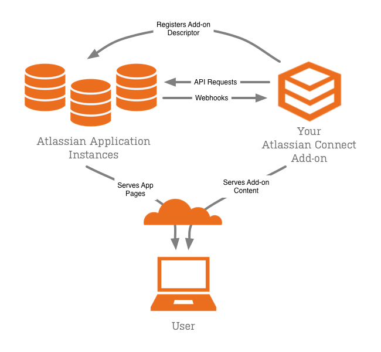

# Introduction to Atlassian Connect
Build, install and sell add-ons in Atlassian OnDemand. Integrate your service, use Atlassian's REST APIs, or add new
features to Atlassian's world class development tools with Atlassian Connect.

    

        
        <strong>Important</strong>
    

    Atlassian Connect is new and in active development for now, but it's growing all the time. If there's a feature
    you'd like to see added to Atlassian Connect, for example a new extension point or a REST resource, please let us know.
    

    Submit new feature requests, bugs, and feature votes in the
    [Atlassian Connect JIRA project](https://ecosystem.atlassian.net/browse/AC).
    

    If you are building an add-on with Atlassian Connect, please subscribe to the
    [mailing list](https://groups.google.com/forum/?fromgroups=#!forum/atlassian-connect-dev). Updates and changes to
    the framework will be posted there.

## What is an Atlassian Connect add-on?
An add-on is simply a web application that extends an Atlassian application. It may be an existing application that you
integrate with the Atlassian application or a new application that you create to add features to an Atlassian application.

Traditional Atlassian add-ons run within an Atlassian application, and were required to be written in Java using
Atlassian's Plugin Framework. Atlassian Connect add-ons, on the other hand, operate remotely over HTTP and can be
written with any programming language and web framework.

Add-ons can modify and extend Atlassian application in a variety of ways, depending on the purpose of the add-on. The
add-on may modify and extend the Atlassian application UI or invoke processes and interact with systems external to the
Atlassian application.

## What every add-on must do
- **Declare itself in a plugin descriptor.** The add-on descriptor is a JSON file that tells the application about the
add-on. Among other information, it tells the Atlassian application about the add-on's URL and the modules it wants to
extend. Administrators install add-ons into Atlassian applications through a registration process.
- **Request the appropriate permissions.** Your add-on must specify what type of access it needs from its host Atlassian
application. For example, can it delete an issue? Can it listen for an event? Can it access administration resources?
You declare required permissions for the add-on in the add-on descriptor file. Permissions determine which REST API
resources the add-on can use.
- **Respond to the application's web hooks.** By registering a webhook, your add-on can receive a notification when
certain events occur (for example, a JIRA issue changes status). The webhook payload contains information about the
event, allowing your add-on to respond appropriately. Every add-on will likely need to listen for and respond to the
webhook triggered when that add-on is enabled in the Atlassian application.
- **Be listed in the Atlassian Marketplace.** Not every add-on should be publicly available on the Atlassian
Marketplace, but even private add-ons need to be registered on the Marketplace in order to be installed to Atlassian
OnDemand. Private listings are not publicly accessible, but allow an organization to implement and deploy add-ons to
their systems only.

## What add-ons can do
- **Add user interface elements to the Atlassian application UI.** The features that an add-on can access or affect in
the Atlassian application are called modules. Modules encapsulate some functional area of the Atlassian application.
For example, there are modules corresponding to:
	- Macros in Confluence
	- Issue panels in JIRA
	- Pages in any application
	- Webhooks for event notifications

Note that not every add-on will need to touch the application UI. An add-on may simply respond to webhooks, for example,
by invoking external processes say in another SaaS application.

- **Recognize the user.** Because your add-on has been authenticated via JWT, each request from the target application
to your add-on contains details about the user currently viewing that page. This allows you to serve the right context,
respect necessary permissions and make other decisions based on the user's identity.
Any application that touches the Atlassian application UI will likely need to recognize the user so that it can adapt
the UI for the user as needed.
- **Call the application's remote API.** Your add-on can call the application's API via REST, either on behalf of a
given user via OAuth or, in some circumstances, as the add-on itself. You can use this to retrieve data (for example,
to build a report) or to push information into the target application (for example, to create an issue in response to
an external event).
- **Respect add-on licensing.** Every request from the Atlassian application to your add-on contains the add-on license
status for that instance. Your add-on can respond appropriately, for example, by alerting the user, locking down
functionality, or encouraging an upgrade.

## Understanding modules
The Atlassian application exposes extension points to add-ons through what are called modules. Modules form the
"surface area" exposed by the application to add-ons. Add-ons use modules to inject and interact with features in the
Atlassian application.

So the first step in discovering what add-ons can do is getting to know the modules. Some modules are common to
Confluence and JIRA, but other are application specific. Modules exist for adding general pages to the application,
configuration pages to the administration console, project tabs to JIRA, and more.

When you declare a module, the framework takes care of many of the details of the integration for you. So, for instance,
if you add a configuration page module, the framework gives you:

- A page in the administration console area of the application
- A link in the navigation menu to your page
- A button in the add-on details view for accessing the configuration

In the module implementation, you specify things like the name of the page, the link text, and the location of the
resource that produces the configuration page content.

Another type of module, a webhook, lets add-ons subscribe to notifications from the Atlassian application. A webhook
specifies the types of events it's interested in listening for using the event attribute. It can listen for events such
as when the plugin is enabled, the server upgraded, and more.

Be sure to explore the JIRA Modules and Confluence Modules sections of this documentation for reference information
specific for each application.

## Deployment architecture
From the Atlassian application instance's perspective, the add-ons themselves operate as a software-as-a-service. To an
end user, the add-on appears as a fully integrated part of the Atlassian application. After subscribing to the add-on,
the features are delivered from within the UI and workflows of the host application.

Most Atlassian Connect developers will choose to implement their add-ons as multi-tenant services. This means that a
single Atlassian Connect application must take into account multiple subscribing organizations. For example, each add-on
will maintain subscriber-specific data and configuration. For more about multi-tenancy design considerations, see
[Add-on Design Considerations](https://developer.atlassian.com/display/AC/Add-on+Design+Considerations).

Security is a important concern in a distributed component model such as Atlassian Connect. Atlassian Connect relies on
HTTPS and OAuth authentication to secure communication between the add-on, the Atlassian product instance and the
end-user's browser.

Further, the add-on's actions in the context of the application are constrained by well-defined permissions. The add-on
can only perform activities it declares in its descriptor, and which are accepted by the administrator. These include,
for example, permissions governing reading content, creating pages, creating issues, and more. This helps to ensure the
security and stability of the OnDemand instance.

For more about security, see [Authentication](authentication.html).

## About REST APIs
Module declarations are one piece to the integration between the add-on and the Atlassian OnDemand application. But
Atlassian Connect add-ons will also use the Atlassian REST APIs. Add-ons can use these APIs to access services of the
Atlassian platform. The services vary between the application type, but there are some common APIs as well.

Since the APIs vary, not only by application and by version but also depending on what other add-on are installed in the
application, the best way to find out what's available is to view the REST API Browser (RAB). The RAB presents a dynamic
view of the REST API in a specific Atlassian application instance.

To learn more about the RAB, see the REST API Browser section of this documentation. Or view the current versions online:

 * [Rest API for Jira](https://jira.atlassian.com/plugins/servlet/restbrowser#/)
 * [Rest API for Confluence](https://confluence.atlassian.com/plugins/servlet/restbrowser#/)

## About this guide
This guide is written for any developer who wants to create Atlassian Connect add-ons to extend Atlassian OnDemand or
installable applications.

To get the most out of this information, you should be familiar with:

- Using and administering Atlassian applications
- Web programming, whether using Java or another language
- Web server concepts and administration.
- Web security standards, such as JWT.
- Interacting with REST APIs

