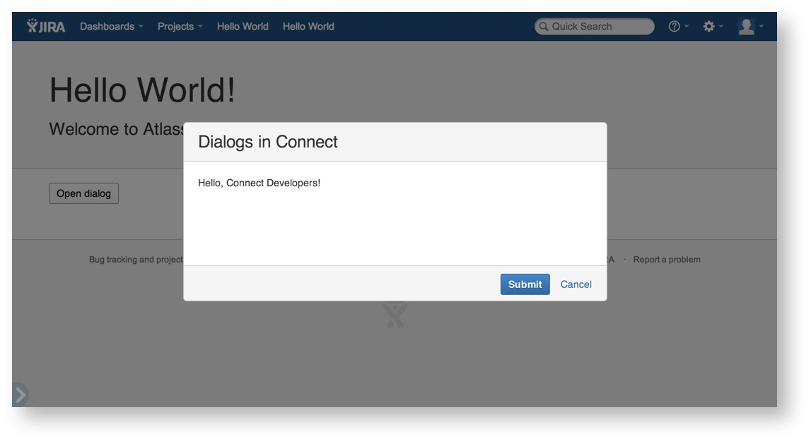
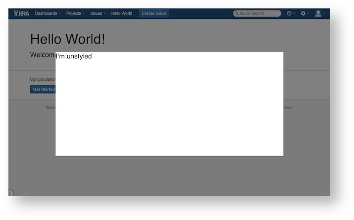

## Seamless iframes

The content for a page module is injected into the Atlassian application in the form of a "seamless" iframe. Seamless iframes are regular HTML iframes but with the following characteristics:

 * Their size is based on the page height and width inside the iframe (i.e., no scrollbars)
 * They are dynamically resized based on the inner content or relative browser window sizing
 * They appear without borders, making them look like a non-iframed fragment of the page
 * For general-pages, you can also opt to size your iframe to take up all of the browser window's space (instead of resizing to its internal content). To do this, add the data-option attribute "sizeToParent:true" in the script tag for all.js. For example, using ACE:

 ```
 <script src="{{hostScriptUrl}}" type="text/javascript" data-options="sizeToParent:true"></script>
 ```

As implied here, for most page content modules, you do not need to be concerned with iframe sizing. It's all handled for you. However, an exception exists for inline macros.

An inline macro is a type of macro that generates content within the text flow of a paragraph or other text element in which the macro appears, such as a status lozenge.

To implement an inline macro, follow these general guidelines:
 1. In your macro-page declaration in the add-on descriptor, set the output-type attribute to inline. (Alternatively, if this value is set to block, the macro content will appear on a new line in the page output.)
 2. If the output content should occupy a certain width and height, set those values as the width and height attributes for the element.
 3. To prevent the macro output from being automatically resized, set the `data-options` attribute in the script tag for all.js to "`resize:false`". This turns off automatic resizing of the iframe.
 4. If the size of the macro output content size is dynamic, call `AP.resize(w,h)` immediately after the DOM of your iframe is loaded. 
 The following example shows a sample macro-page declaration in the add-on descriptor:
```
<macro-page key="cheese" name="Cheese" url="/cheese" output-type="inline" width="200px" height="38px" />
```
For more information about the macro-page module, see the [documentation](../modules/confluence/macro.html)

## Sandboxing
An iframe instance whose parent and child reside on different domains or hostnames constitutes a [sandboxed environment](http://en.wikipedia.org/wiki/Sandbox_%28computer_security%29). The contained page has no access to its parent. These restrictions are imposed by the browser's [same origin policy](http://en.wikipedia.org/wiki/Same_origin_policy).

There are a few limitations applicable to iframes:

 * Stylesheet properties from the parent do not cascade to the child page
 * Child pages have no access to its parent's DOM and JavaScript properties
 * Likewise, the parent has no access to its child's DOM or JavaScript properties

However, Atlassian Connect makes use of a technique called [cross-domain messaging](http://easyxdm.net/wp/). This technique provides a string-based transport stack that allows communication between the iframe and its parent using one of several available techniques. The most efficient technique is based on the browser's capabilities.

Atlassian Connect transparently enables cross-domain messaging in its page modules. One benefit you'll see from this is that your add-on's page modules are automatically resized based on its content when loaded on the page.

## Sharing data between iframes
A single add-on can generate multiple iframes in a particular page in the target application. Depending on the use case for the add-on, the iframes may need to share information between each other.

The Atlassian Connect JavaScript client library, `all.js`, provides a publish/subscribe mechanism that you can use to exchange data between iframes.
<div class="aui-message warning shadowed information-macro">
A common scenario in which a single add-on presents multiple iframes in a page is where a web panel or other page element spawns a dialog box. However, the Dialog2 module provides its own, relatively seamless means for conveying data between a dialog iframe and its parent iframe (which itself is built upon the publish/subscribe mechanism described here). 
</div>

The only restriction on the data shared in this manner is that it must be serializable to JSON, the format in which the data is conveyed on the shared bus.

### Accessing the add-on Events API

To share data between iframes, the add-on requires the events module, as follows:

```
AP.require("events", function (events) {
  // Use the 'events' object here
});
```
Within the declaration, you can add your code for subscribing to and publishing events, using the API methods described in the following section. 

#### Event API method reference
You can use the following methods to subscribe to, unsubscribe from, or publish events to the event bus:

<div class="table-wrap">
    <table class="confluenceTable">
        <tbody>
            <tr>
                <th class="confluenceTh">Method</th>
                <th class="confluenceTh">Description</th>
            </tr>
            <tr>
                <td class="confluenceTd"><code>on</code></td>
                <td class="confluenceTd">
                    <p>Adds a listener for all occurrences of an event of a particular name. Listener arguments include any arguments passed to <code>events.emit</code>, followed by an object describing the complete event information.</p>
                    <div class="code panel pdl" style="border-width: 1px;">
                        events.on("event-name", function () { /* ... */ })
                    </div>
                </td>
            </tr>
            <tr>
                <td colspan="1" class="confluenceTd"><code>once</code></td>
                <td colspan="1" class="confluenceTd">
                    <p>Adds a listener for one occurrence of an event of a particular name. Listener arguments include any argument passed to <code>events.emit</code>, followed by an object describing the complete event information.</p>
                    <div class="code panel pdl" style="border-width: 1px;">
                        <div class="codeContent panelContent pdl">
                            events.once("event-name", function () { /* ... */ })
                        </div>
                    </div>
                </td>
            </tr>
            <tr>
                <td colspan="1" class="confluenceTd"><code>onAny</code></td>
                <td colspan="1" class="confluenceTd">
                    Adds a listener for all occurrences of any event, regardless of name. Listener arguments begin with the event name, followed by any arguments passed to <code>events.emit</code>, followed by an object describing the complete event information.
                    <p> </p>
                    <div class="code panel pdl" style="border-width: 1px;">
                        <div class="codeContent panelContent pdl">
                            events.onAny(function (name) { /* ... */ })
                        </div>
                    </div>
                </td>
            </tr>
            <tr>
                <td colspan="1" class="confluenceTd"><code>off</code></td>
                <td colspan="1" class="confluenceTd">
                    <p>Removes a particular listener for an event.</p>
                    <div class="code panel pdl" style="border-width: 1px;">
                        <div class="codeContent panelContent pdl">
                            events.off("event-name", listener)
                        </div>
                    </div>
                </td>
            </tr>
            <tr>
                <td colspan="1" class="confluenceTd"><code>offAll</code></td>
                <td colspan="1" class="confluenceTd">
                    <p>Removes all listeners for a given event.</p>
                    <div class="code panel pdl" style="border-width: 1px;">
                        <div class="codeContent panelContent pdl">
                           events.offAll("event-name")
                        </div>
                    </div>
                </td>
            </tr>
            <tr>
                <td colspan="1" class="confluenceTd"><code>offAny</code></td>
                <td colspan="1" class="confluenceTd">
                    <p>Removes an <code>any</code> event listener.</p>
                    <div class="code panel pdl" style="border-width: 1px;">
                        <div class="codeContent panelContent pdl">
                            events.offAny(listener)
                        </div>
                    </div>
                </td>
            </tr>
            <tr>
                <td colspan="1" class="confluenceTd"><code>emit</code></td>
                <td colspan="1" class="confluenceTd">
                    <p>Publishes an event of a particular name, with an optional list of arguments. <span style="color: rgb(0,51,102);">We recommend that each time a well-defined type of event is published, it includes a consistent number of arguments (including when the argument number is zero).</span> <span> </span></p>
                    <div class="code panel pdl" style="border-width: 1px;">
                        <div class="codeContent panelContent pdl">
                            events.emit("event-name" /* , arg1, arg2, etc */)
                        </div>
                    </div>
                </td>
            </tr>
        </tbody>
    </table>
</div>


#### Events API sample

The following sample code will give you a fuller picture of how an add-on can use the API to exchange data between two iframes.

An add-on can generate (or publish) data from within an iframe as follows:
```
AP.require("events", function (events) {
  $("#save-button").click(function () {
    events.emit("saved", model);
  });
});
```

Notice that the iframe publishes an event named saved, and populates the object named model with the data.

In the same add-on, the iframe that acts as the consumer subscribes to the saved event, and refreshes its view with the data it has obtained from the publisher (in the model object), as follows:

```
AP.require("events", function (events) {
  events.on("saved", function (model) {
    view.refresh(model);
  });
});
```

### JavaScript client library

Atlassian Connect provides a JavaScript client library called all.js. The Atlassian application hosts this file, making it available at the following location relative to the Atlassian application URL: 

`<hostname>/<app_context>/atlassian-connect/all.js`

For example:
`http://atlas-laptop:2990/jira/atlassian-connect/all.js`

This library establishes the cross-domain messaging bridge with its parent. It also provides several methods and objects that you can use in your pages without making a trip back to your add-on server.

You must add the `all.js` script to your pages in order to establish the cross-domain messaging bridge. Make sure your pages include the following script:

```
<script src="https://{OnDemand hostname}/{context}/atlassian-connect/all.js"></script>
```

If you're using the [atlassian-connect-express](https://bitbucket.org/atlassian/atlassian-connect-express) client library to build your add-on, this will automatically be inserted into your pages at run time.

<div class="aui-message warning shadowed information-macro">
Don't download the all.js file and serve it up from your add-on server directly. The all.js file must be served up by the parent in order for the cross-domain messaging bridge to be established.
</div>

## AP.* helpers 
The `all.js` script makes available a JavaScript object called AP. The AP object contains a handful of helpful client-side methods and properties. You can use some of these methods to get information from the parent document.

<div class="table-wrap">
    <table class="confluenceTable">
        <tbody>
            <tr>
                <th class="confluenceTh">Methods/Objects</th>
                <th class="confluenceTh">Description</th>
                <th colspan="1" class="confluenceTh">Status</th>
            </tr>
            <tr>
                <td colspan="1" class="confluenceTd">
                    <p><code>AP.Dialog</code></p>
                </td>
                <td colspan="1" class="confluenceTd">
                    <p><span>Provides access to dialog controls when the add-on is running as dialog content.</span></p>
                </td>
                <td colspan="1" class="confluenceTd"><span class="status-macro aui-lozenge aui-lozenge-error">EXPERIMENTAL</span></td>
            </tr>
            <tr>
                <td colspan="1" class="confluenceTd"><code>AP.Meta</code></td>
                <td colspan="1" class="confluenceTd">Gets the metadata that's stored in any &lt;meta&gt; tags on the page.</td>
                <td colspan="1" class="confluenceTd"><span class="status-macro aui-lozenge aui-lozenge-error">EXPERIMENTAL</span></td>
            </tr>
            <tr>
                <td colspan="1" class="confluenceTd"><code>AP.clearMessage(id)</code></td>
                <td colspan="1" class="confluenceTd">Clears an AUI message notification on the page.</td>
                <td colspan="1" class="confluenceTd"><span class="status-macro aui-lozenge aui-lozenge-error">EXPERIMENTAL</span></td>
            </tr>
            <tr>
                <td colspan="1" class="confluenceTd"><code>AP.getLocation(callback)</code></td>
                <td colspan="1" class="confluenceTd">Gets the host page's window.location.href value.</td>
                <td colspan="1" class="confluenceTd"><span class="status-macro aui-lozenge aui-lozenge-success">STABLE</span></td>
            </tr>
            <tr>
                <td colspan="1" class="confluenceTd"><code>AP.getTimeZone(callback)</code></td>
                <td colspan="1" class="confluenceTd">Gets the user's timezone.</td>
                <td colspan="1" class="confluenceTd"><span class="status-macro aui-lozenge aui-lozenge-success">STABLE</span></td>
            </tr>
            <tr>
                <td colspan="1" class="confluenceTd"><span><code>AP.getUser(callback)</code> <br /></span></td>
                <td colspan="1" class="confluenceTd">Gets the user's basic profile information.</td>
                <td colspan="1" class="confluenceTd"><span class="status-macro aui-lozenge aui-lozenge-success">STABLE</span></td>
            </tr>
            <tr>
                <td colspan="1" class="confluenceTd"><code>AP.localUrl(path)</code></td>
                <td colspan="1" class="confluenceTd">Returns the fully qualified URL of the host, concatenated with the supplied path.</td>
                <td colspan="1" class="confluenceTd"><span class="status-macro aui-lozenge aui-lozenge-error">EXPERIMENTAL</span></td>
            </tr>
            <tr>
                <td colspan="1" class="confluenceTd"><code>AP.request(url, options)</code></td>
                <td colspan="1" class="confluenceTd">Ajax client for making requests through the parent. Extends jQuery's Ajax object and returns a promise.</td>
                <td colspan="1" class="confluenceTd"><span class="status-macro aui-lozenge aui-lozenge-success">STABLE</span></td>
            </tr>
            <tr>
                <td colspan="1" class="confluenceTd"><code>AP.resize(options)</code></td>
                <td colspan="1" class="confluenceTd">Resizes the iframe with the dimensions supplied in the options object. If no dimensions are supplied, the method attempts to determine the size of the page and resizes it accordingly.</td>
                <td colspan="1" class="confluenceTd"><span class="status-macro aui-lozenge aui-lozenge-success">STABLE</span></td>
            </tr>
            <tr>
                <td colspan="1" class="confluenceTd"><code>AP.showMessage(id, title, body)</code></td>
                <td colspan="1" class="confluenceTd">Shows an AUI message box.</td>
                <td colspan="1" class="confluenceTd"><span class="status-macro aui-lozenge aui-lozenge-error">EXPERIMENTAL</span></td>
            </tr>
        </tbody>
    </table>
</div>

The following section provides more usage information on an AP object helper.

## Dialog
You use the AP helper Dialog to launch a dialog box from a parent iframe.

By default, the dialog is undecorated. In other words, it does not contain any title, content or buttons. It only contains an iframe pointing to a URL that you provide. The resource at the URL should present both the style and content for the dialog. A basic dialog looks like this: 


Notice that the sample shown contains a submit button, but this is provided by the sample resource referenced by the dialog URL. There is no built-in "submit" or "cancel" button in the dialog helper.

In your own add-ons, you can style dialogs to either your own branding or the [Atlassian Design Guidelines](https://developer.atlassian.com/design/latest/modal-dialog.html) (ADG).

<div class="aui-message warning shadowed information-macro">
The next AUI release (AUI 5.3) will make it much easier for Atlassian Connect developers to render ADG dialogs using the new dialog2 component.
</div>

### Opening a dialog
To add a dialog to a page, invoke the dialog create function from the iframe from which the dialog should be launched. For example:
```
jQuery('#launch-dialog').click(function(evt){
    AP.require("dialog", function(dialog) {
        dialog.create({
            key: "key-of-dialog-page", // the descriptor key of the page that you want to open in a dialog
            size: "medium", // small, medium, large, x-large (optional)
            // width: 600, // in pixels (optional)
            // height: 400, // in pixels (optional)
        })
        .on('close', function(data){
            console.log(data); // do something with data
        });
    });
});
```

The dialog `create` function takes a single required parameter, key, which is the add-on descriptor key of the page that presents the dialog content.

The function takes several optional parameters that control the size of the dialog. To specify a size, you can specify either a named size or an explicit width and height for the dialog box. Namely, the parameters are:

 * size: the size of the dialog. The sizes correspond to those in the Atlassian Design Guidelines (https://developer.atlassian.com/design/latest/modal-dialog.html):
    * small
    * medium
    * large
    * x-large
 * width: the explicit width for the dialog in pixels (e.g., 600).
 * height: the explicit height for the dialog in pixels (e.g., 400).

If the dialog contains ADG-styled content, it should use one of the named sizes. The explicit width and height parameters let you implement fixed-size dialogs that contain non-ADG content (for example, to implement a dialog that has the look and feel of an external web site). In general, we do not advise you to use a specific height, as Atlassian Connect dialogs are sized dynamically to the height of the window.

If you don't specify a size, the dialog uses the default size, medium.

### Closing the dialog
The dialog iframe can close itself (say in response to a button click) by calling the `close` method:
```
jQuery('#close-dialog').click(function(evt){
    AP.require("dialog", function(dialog) {
        // Close the dialog and send the following JSON object
        dialog.close({
            hello: "world"
        });
    });
});
```

The `close` method takes a single parameter, which must be a pure data object (i.e., no functions).

The iframe that launched the dialog can capture the data generated by the dialog by listening for the dialog's close event. This is the only event exposed to the launcher. The handler passed to the close event includes a single parameter that contains the data that the dialog passed to its `close` method.


### Styling your dialog to look like a standard Atlassian dialog
As mentioned above, by default the dialog iframe is undecorated. It's up to the developer to style the dialog.


In order to maintain a consistent look and feel between the host application and the add-on, we encourage add-on developers to style their dialogs to match Atlassian's Design Guidelines for modal dialogs. To do that, you'll need to add the AUI styles to your dialog page.

<div class="aui-message warning shadowed information-macro">
Because the dialog2 component in AUI is still experimental, you can use the [HTML referenced on the dialog2 documentation](https://docs.atlassian.com/aui/5.3-m4/docs/dialog2.html).
</div>
