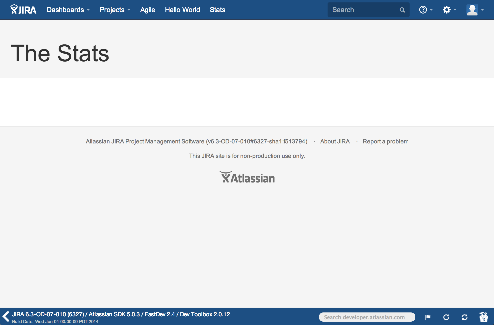
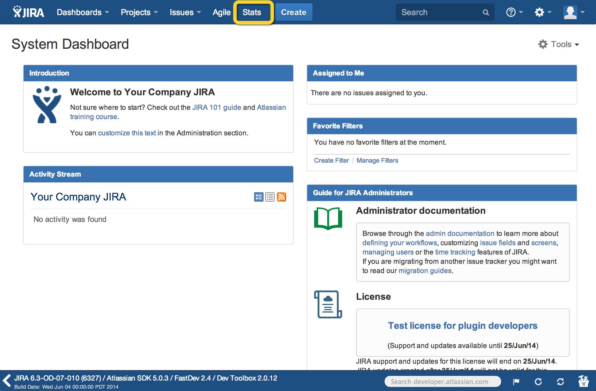
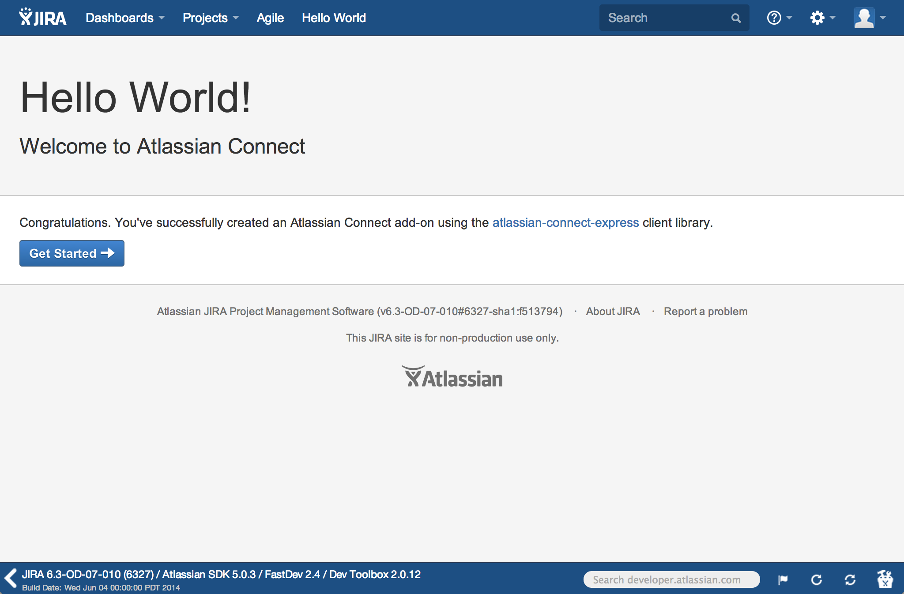
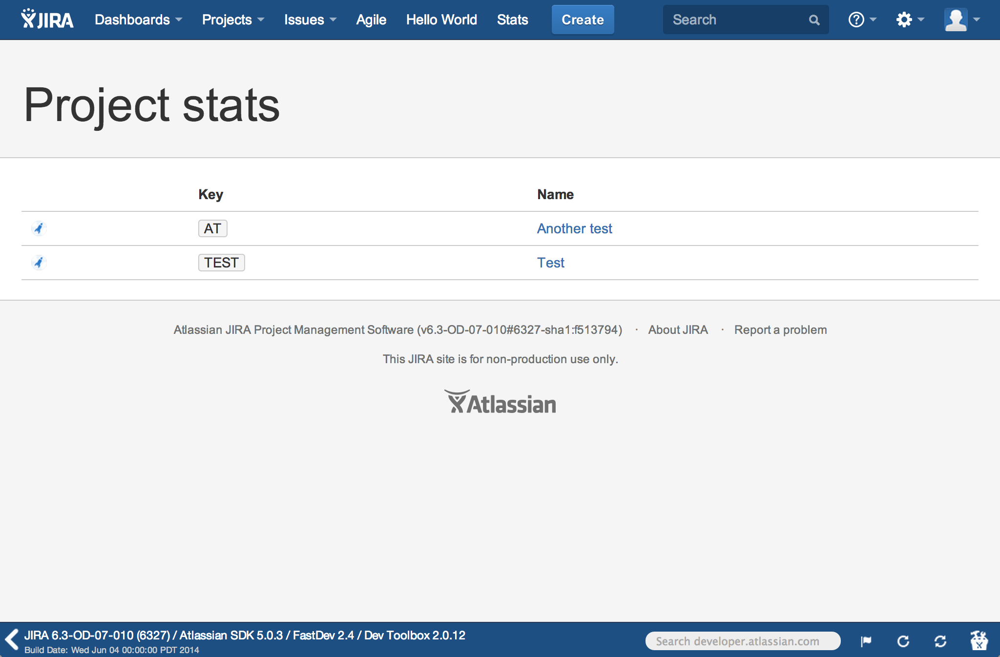

##Tutorial: Display your projects in JIRA 

<div class="aui-message">
	    <p class="title">
	        <span class="aui-icon icon-info"></span>
	        <strong>Who this tutorial is for</strong>
	    </p>
	    <p>
	    You can complete this tutorial even if you've never built an Atlassian add-on before. You'll 
	    need at least version 4.2.20 of the [Atlassian SDK installed](https://developer.atlassian.com/display/DOCS/Downloads), 
	    and [Node.js](http://www.nodejs.org/). 
	    </p>
</div>

In this tutorial, you'll learn about:

* [Configuring your development environment](#environment)  
* [Adding an _Activity_ link in the navigation header](#stats-header)  
* [Creating the D3.js table to display your projects](#architect-stats-page)
* [Adding data and verifying your add-on works](#check)

To display your JIRA projects in a table, you'll build a static Connect add-on 
accessible via an _Activity_ link in the header. 

Your static page will use the [JIRA REST API](https://jira.atlassian.com/plugins/servlet/restbrowser#/) 
to retrieve information about projects in your JIRA instance. You'll use the [Node.js](http://nodejs.org/) 
framework and [Atlassian Connect Express (ACE)](https://bitbucket.org/atlassian/atlassian-connect-express/) 
to interface with JIRA. Finally, you'll create your table using [D3.js](http://d3js.org/). 

Here's an example what your add-on might look like: 

 

## <a name="environment"></a> Configuring your development environment  

In this step, you'll confirm you have node.js installed, and install the 
[Atlassian Connect Express](https://bitbucket.org/atlassian/atlassian-connect-express/) framework, known as 
ACE. ACE is a toolkit for creating Connect add-ons using node.js. ACE handles registration in JIRA for you. 
It also detects changes made to your [`atlassian-connect.json` descriptor](../modules/) 
file, so you don't need to continually restart your add-on as you develop. 
Importantly, ACE handles [JWT authentication](../concepts/understanding-jwt.html), 
so that requests betwen your add-on and the JIRA application are signed and authenticated. 

For these steps, you might need to enter sudo mode in your terminal. 

1. Install [node.js](http://www.nodejs.org/).  
	If you use [Homebrew](http://brew.sh/), you can use the following command:
	<pre><code data-lang="text">$ brew install node</code></pre>
	Otherwise, you can [download and install node directly](http://nodejs.org/download/).  
1. Install the [ACE framework](https://bitbucket.org/atlassian/atlassian-connect-express/).
	<pre><code data-lang="text">$ npm install -g atlas-connect</code></pre>
1. Create a new ACE project called `project-activity`.
	<pre><code data-lang="text">$ atlas-connect new project-activity</code></pre>
1. Change to your new `project-activity` directory.
	<pre><code data-lang="text">$ cd project-activity/</code></pre>
1. Install node.js dependencies for your project.  
	<pre><code data-lang="text">$ npm install</code></pre>
1. Ensure you have the [Atlassian SDK installed](https://developer.atlassian.com/display/DOCS/Downloads).  
    You'll need SDK version 4.2.20 or higher.  
    <pre><code data-lang="text">$ atlas-version</code></pre>
    You should see 4.2.20 or higher:  
    <tt>
        ATLAS Version:    4.2.20  
        ATLAS Home:       /usr/share/atlassian-plugin-sdk-4.2.20  
        ATLAS Scripts:    /usr/share/atlassian-plugin-sdk-4.2.20/bin  
        ATLAS Maven Home: /usr/share/atlassian-plugin-sdk-4.2.20/apache-maven  
    </tt>
1. Start JIRA in cloud mode:
	<pre><code data-lang="text">atlas-run-standalone --product jira --version 6.3-OD-07-010 --bundled-plugins com.atlassian.plugins:atlassian-connect-plugin:1.0.2,com.atlassian.jwt:jwt-plugin:1.0.0,com.atlassian.bundles:json-schema-validator-atlassian-bundle:1.0-m0  --jvmargs -Datlassian.upm.on.demand=true</code></pre>
    
    You'll see a lot of output. When finished, your terminal notifies you that the build 
    was successful:  
    <tt>[INFO] [talledLocalContainer] Tomcat 7.x started on port [2990]  
        [INFO] jira started successfully in 217s at http://localhost:2990/jira  
        [INFO] Type Ctrl-D to shutdown gracefully  
        [INFO] Type Ctrl-C to exit
    </tt>  
1. In a browser window, navigate to your JIRA instance.  
	This should be [http://localhost:2990/jira](http://localhost:2990/jira).  
1. Log in with `admin/admin`. 

## <a name="stats-header"></a> Install your add-on and add an _Activity_ link

Now you've got the basic architecture for your plugin. If you open your new `project-activity` directory, 
you'll see essentials like the [`atlassian-connect.json` descriptor](../modules/) in the 
root. You'll also see an `app.js` file. 

In this step, you'll prune some of the stub code, and install your add-on in JIRA using ACE. 

1. Open the [`atlassian-connect.json` descriptor](../modules/) file in your favorite editor or IDE.
1. Replace the [`generalPages` module](../modules/jira/general-page.html) with the following:  
	````
     "generalPages": [

	    {
	        "key": "stats",
	        "location": "system.top.navigation.bar",
	        "name": {
	            "value": "Stats"
	        },
	        "url": "/stats",
	        "conditions": [{
	            "condition": "user_is_logged_in"
	        }]
	    }
    ]
   ````
   This adds an _Activity_ link in the `system.top.navigation.bar`, or in other words, the JIRA 
   header. It also provides a condition that the link only appears to authenticated users, 
   and sets a URL for your add-on to use under `/activity`.
1. Add a `read` scope inside the main object:
	````
	"scopes": [
	    "read"
	]
	````
	This enables your Connect add-on to read your JIRA project data.  
	At this point, your descriptor file should look like this:  
	````
	{
	    "key": "my-add-on",
	    "name": "Ping Pong",
	    "description": "My very first add-on",
	    "vendor": {
	        "name": "Angry Nerds",
	        "url": "https://www.atlassian.com/angrynerds"
	    },
	    "baseUrl": "{{localBaseUrl}}",
	    "links": {
	        "self": "{{localBaseUrl}}/atlassian-connect.json",
	        "homepage": "{{localBaseUrl}}/atlassian-connect.json"
	    },
	    "authentication": {
	        "type": "jwt"
	    },
	    "lifecycle": {
	        "installed": "/installed"
	    },
	    "modules": {
	        "generalPages": [

	            {
	                "key": "activity",
	                "location": "system.top.navigation.bar",
	                "name": {
	                    "value": "Activity"
	                },
	                "url": "/stats",
	                "conditions": [{
	                    "condition": "user_is_logged_in"
	                }]
	            }
	        ]
	    },
	    "scopes": [
	        "read"
	    ]
	}
	````
 
1. Open a new terminal window.  
1. From your `project-activity` root, run the `app.js` file:
	<pre><code data-lang="text">$ node app.js</code></pre> 
	Your add-on is automatically registered in JIRA for you. 
1. Refresh JIRA in your browser.  
	You'll see the _Activity_ label in the header: 
	  
1. Open `routes/index.js`.
	From here, you'll add the `/activity` route to your app.
1. After the `/hello-world` stub code, add:  
	````
	app.get('/activity', addon.authenticate(), function(req, res) {
	    res.render('stats', { title: "The Stats" });
	});
	````  
	Your `routes/index.js` file should resemble this:  
	````
	module.exports = function (app, addon) {

	    // Root route. This route will serve the `atlassian-connect.json` unless the
	    // documentation url inside `atlassian-connect.json` is set
	    app.get('/', function (req, res) {
	        res.format({
	            // If the request content-type is text-html, it will decide which to serve up
	            'text/html': function () {
	                res.redirect('/atlassian-connect.json');
	            },
	            // This logic is here to make sure that the `atlassian-connect.json` is always
	            // served up when requested by the host
	            'application/json': function () {
	                res.redirect('/atlassian-connect.json');
	            }
	        });
	    });

	    // This is an example route that's used by the default "generalPage" module.
	    // Verify that the incoming request is authenticated with Atlassian Connect
	    app.get('/hello-world', addon.authenticate(), function (req, res) {
	            // Rendering a template is easy; the `render()` method takes two params: name of template
	            // and a json object to pass the context in
	            res.render('hello-world', {
	                title: 'Atlassian Connect'
	                //issueId: req.query('issueId')
	            });
	        }
	    );

	    // Add any additional route handlers you need for views or REST resources here...
	    app.get('/stats', addon.authenticate(), function(req, res) {
	        res.render('stats', { title: "Project activity" });
	    });
	};
	````
	This route titles your __Activity__ page "Project activity", and ensures that your add-on 
	is authenticated.  
1. Close and save your `atlassian-connect.json` and `routes/index.js` files.  
 

## <a name="architect-stats-page"></a> Build the static _Activity_ page  

You've added a link in the JIRA header, but your page doesn't have anything 
except a title right now. In this step, you'll add the capability for your add-on 
to use D3.js, and define how the page should look. 

1. Open `views/layout.hbs`.
1. Add the following to the `views/layout.hbs` file following the `hostScriptUrl` 
	line: 
	````
	<script src="http://d3js.org/d3.v3.min.js" charset="utf-8"></script>
	````
	This lets you to use d3 for your chart.  
1. Create a new file called `views/stats.hbs`.  
1. Add the following content: 
	````
	{{!< layout}}
	<header class="aui-page-header">
	    <div class="aui-page-header-inner">
	        <div class="aui-page-header-main intro-header">
	            <h1>{{title}}</h1>
	        </div>
	    </div>
	</header>

	<div class="aui-page-panel main-panel">
	    <div class="aui-page-panel-inner">
	        <section class="aui-page-panel-item">
	            <div class="aui-group">
	                <div class="aui-item">
	                    <div class="projects">
	                    </div> 
	                </div>
	            </div>
	        </section>
	    </div>
	</div>
	<script type="text/javascript">
	    $(function() {
	        AG.initInstanceStats();
	    });
	</script>
	````
1. Open `public/js/addon.js`.  
1. Add the following content:  
	````
	(function() {
	    function getQueryParams(qs) {
	        qs = qs.split("+").join(" ");

	        var params = {}, tokens,
	        re = /[?&]?([^=]+)=([^&]*)/g;

	        while (tokens = re.exec(qs)) {
	            params[decodeURIComponent(tokens[1])] = 
	                decodeURIComponent(tokens[2]);
	        }

	        return params;
	    }

	    /* add-on script */
	    window.AG = {};

	    window.AG.apiCall = function(uri, callback) {
	        AP.require('request', function(request) {
	            request({
	                url: uri,
	                success: function(response) {
	                    callback(response);
	                },
	                error: function(response) {
	                    console.log("Error loading API (" + uri + ")");
	                    console.log(arguments);
	                },
	                contentType: "application/json"
	            });
	        });
	    };

	    window.AG.initInstanceStats = function() {
	        var params = getQueryParams(document.location.search);
	        var baseUrl = params.xdm_e + params.cp + "/browse/";

	        AG.apiCall('/rest/api/2/project', function(response) {
	            // convert the string response to JSON
	            response = JSON.parse(response);

	            var d = d3.select(".projects")

	            var projTable = d.append('table')
	                .classed({'project': true, 'aui': true});

	            var projHeadRow = projTable.append("thead").append("tr");
	            projHeadRow.append("th");
	            projHeadRow.append("th").text("Key");
	            projHeadRow.append("th").text("Name");

	            var projBody = projTable.append("tbody");

	            var row = projBody.selectAll("tr")
	                .data(response)
	                .enter()
	                .append("tr");

	            row.append("td").append('span')
	                .classed({'aui-avatar': true, 'aui-avatar-xsmall': true})
	                .append('span')
	                .classed({'aui-avatar-inner': true})
	                .append('img')
	                .attr('src', function(item) { return item.avatarUrls["16x16"] });

	            row.append("td").append('span')
	                .classed({'project-key': true, 'aui-label': true})
	                .text(function(item) { return item.key; });

	            row.append("td").append('span')
	                .classed({'project-name': true})
	                .append("a")
	                .attr('href', function(item) { return baseUrl + item.key; })
	                .attr('target', "_top")
	                .text(function(item) { return item.name; });
	        });
	    };
	})();
	````
	This leverages d3.js to build a table to display all your JIRA projects. You use a 
1. Save and close all files. 
1. Restart the node app. 
	You can shut down the app with __CTRL+C__ and re-run the __`node app.js`__ 
	command.
1. Click __Activity__ in the header.  
	You'll see an empty page with your "Project stats" title:  
	   
	Your page is blank since your JIRA instance doesn't yet have any data, but you'll 
	fix that in the next step!  

## <a name="check"></a> Add some data, and verify your add-on works

Your add-on is essentially done, but you don't have any data to validate 
how your chart works. In this step, you'll manually add a few projects and 
issues, and validate that your chart reflects the changes.  

1. Click __Projects__ > __Create Project__ in the header.  
	Run through the prompts and create a project.  
1. Repeat as desired.  
1. Check your add-on between adding data.  
	You should see your __Activity__ table update accordingly, each time you click the 
	link.  
	Here's an example what you'll see (using two projects, "Test" and "Another test"): 
	 


