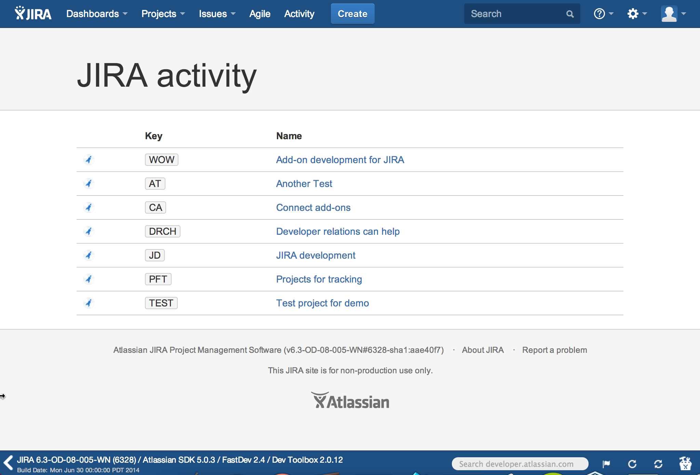
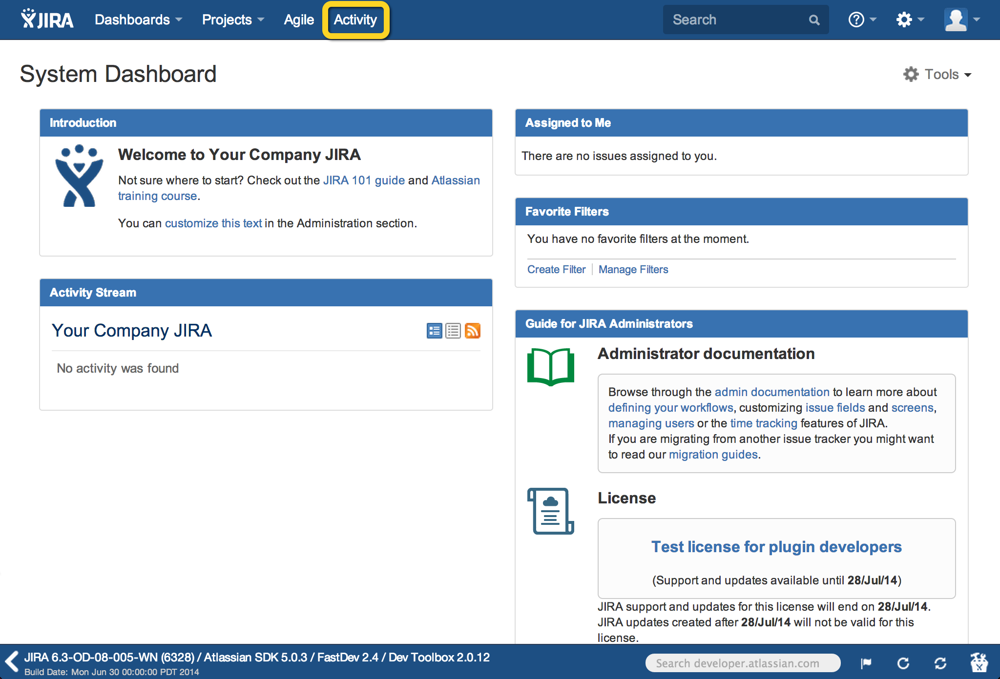
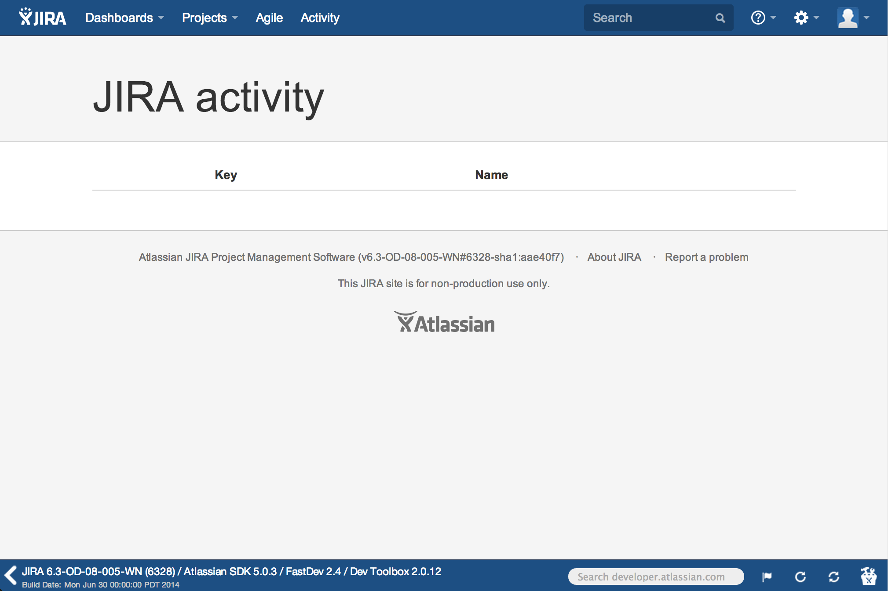
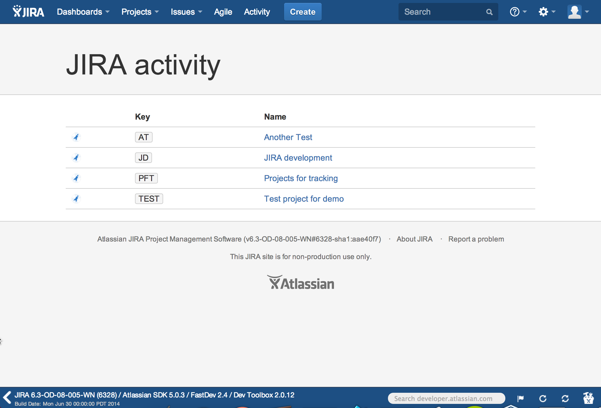

##Tutorial: Display your projects in JIRA

<div class="aui-message">
	    <p class="title">
	        <span class="aui-icon icon-info"></span>
	        <strong>Who this tutorial is for</strong>
	    </p>
	    <p>
	    You can complete this tutorial even if you've never built an Atlassian add-on before. You'll
	    need at least version 4.2.20 of the [Atlassian SDK installed](https://developer.atlassian.com/display/DOCS/Downloads),
	    and <a href="http://www.nodejs.org/" target="_blank">Node.js</a>.
	    </p>
</div>

In this tutorial, you'll learn about:

* [Configuring your development environment](#environment)  
* [Adding an _Activity_ link in the navigation header](#activity-header)  
* [Creating the D3.js table to display your projects](#architect-page)
* [Adding data and verifying your add-on works](#check)

This tutorial shows you how to build a static Connect add-on that displays your JIRA projects 
in a table, accessible via an _Activity_ link in the header. 

Your add-on will use the [JIRA REST API](https://docs.atlassian.com/jira/REST/latest/) 
to get information about projects in your instance. You'll use the [Node.js](http://nodejs.org/) 
framework and <a href="https://bitbucket.org/atlassian/atlassian-connect-express/" target="_blank">
Atlassian Connect Express (ACE)</a> to interface with JIRA. Finally, you'll create a table of your 
projects using <a href="http://d3js.org/" target="_blank">D3.js</a>.

When you're finished, your add-on will look similar to this: 



## <a name="environment"></a> Configuring your development environment  

In this step, you'll confirm you have Node.js installed, and install the 
[Atlassian Connect Express (ACE)](https://bitbucket.org/atlassian/atlassian-connect-express/) toolkit. 
ACE helps you create Connect add-ons using Node.js, and handles add-on registration in JIRA for you. 
It also detects changes made to your [`atlassian-connect.json` descriptor](../modules/) 
file, so you don't need to continually restart your add-on as you develop. 
Importantly, ACE also handles [JSON web token (JWT)](../concepts/understanding-jwt.html), 
so that requests betwen your add-on and the JIRA application are signed and authenticated. 

1. Ensure you have the [Atlassian SDK installed](https://developer.atlassian.com/display/DOCS/Downloads).  
    You'll need SDK version 4.2.20 or higher.  
    <pre><code data-lang="text">$ atlas-version</code></pre>
    You should see 4.2.20 or higher:  
    <tt>
        ATLAS Version:    4.2.20  
        ATLAS Home:       /usr/share/atlassian-plugin-sdk-4.2.20  
        ATLAS Scripts:    /usr/share/atlassian-plugin-sdk-4.2.20/bin  
        ATLAS Maven Home: /usr/share/atlassian-plugin-sdk-4.2.20/apache-maven  
    </tt>
1. Install <a href="http://www.nodejs.org/" target="_blank">Node.js</a>.  
	If you use [Homebrew](http://brew.sh/), you can use the following command:
	<pre><code data-lang="text">$ brew install node</code></pre>  
	If you use Windows or don't use Homebrew, you can <a href="http://nodejs.org/download/" target="_blank">
	download and install Node.js directly</a>.
	You might need to enter `sudo`.  
1. Install <a href="https://bitbucket.org/atlassian/atlassian-connect-express/" target="_blank">ACE</a> using the 
	<a href="https://www.npmjs.org/package/npm-install" target="_blank"><tt>npm install</tt> command</a>.
	<pre><code data-lang="text">$ npm install -g atlas-connect</code></pre>
1. Create a new ACE project called `jira-activity`.
	<pre><code data-lang="text">$ atlas-connect new jira-activity</code></pre>
1. Change to your new `jira-activity` directory.
	<pre><code data-lang="text">$ cd jira-activity/</code></pre>
1. Install Node.js dependencies for your `jira-activity` project.  
	<pre><code data-lang="text">$ npm install</code></pre>
1. Start JIRA in cloud mode from your `jira-activity` root:  
<script>getCommands('../');</script>
<span id="commands-jira-prd">Loading...</span>

    You'll see a lot of output. When finished, your terminal will notify you that the build
    was successful:  
    <tt>[INFO] [talledLocalContainer] Tomcat 7.x started on port [2990]  
        [INFO] jira started successfully in 217s at http://localhost:2990/jira  
        [INFO] Type Ctrl-D to shutdown gracefully  
        [INFO] Type Ctrl-C to exit
    </tt>  
1. In a browser window, navigate to your JIRA instance.  
	JIRA should be at <a href="http://localhost:2990/jira" target="_blank">http://localhost:2990/jira</a>.  
1. Log in with the following credentials.  
	__Username__: `admin`  
	__Password__: `admin`  
	You might see a message that JIRA's base URL doesn't match your local host. You can click to update JIRA's base URL, 
	or hide the message.


## <a name="activity-header"></a> Install your add-on and add an _Activity_ link

Now you've got the basic architecture for your add-on. If you open your new `jira-activity` directory, 
you'll see essentials like the [`atlassian-connect.json` descriptor](../modules/) in the 
root. You'll also see an `app.js` file. 

In this step, you'll prune some of the stub code, and install your add-on in JIRA using ACE.

1. Open the [`atlassian-connect.json` descriptor](../modules/) file in your favorite editor or IDE.
1. Replace the `key`, `name`, `description`, and `vendor` name and URL with these fields: 
	````
	{
	    "key": "jira-activity",
	    "name": "JIRA Project Activity",
	    "description": "A Connect add-on that displays JIRA projects in a table",
	    "vendor": {
	        "name": "Atlassian Developer Relations",
	        "url": "https://developer.atlassian.com/"
		},
	````
	This names your add-on in in your JIRA instance, and essentially makes it yours. 
1. Replace the content of `modules` with a [`generalPages` module](../modules/jira/general-page.html):  
	````
     "generalPages": [
 
	    {
	        "key": "activity",
	        "location": "system.top.navigation.bar",
	        "name": {
	            "value": "Activity"
	        },
	        "url": "/activity",
	        "conditions": [{
	            "condition": "user_is_logged_in"
	        }]
	    }
    ]
   ````
   This adds an _Activity_ link in the JIRA header (`system.top.navigation.bar`), and sets a URL for your add-on 
   to use under `/activity`. It also provides a condition so that the REST API shows private projects visible to 
   a logged in user, not just public projects. 

   At this point, your descriptor file should look like this:  
	````
	{
	    "key": "jira-activity",
	    "name": "JIRA Project Activity",
	    "description": "A Connect add-on that displays JIRA projects in a table",
	    "vendor": {
	        "name": "Atlassian Developer Relations",
	        "url": "https://developer.atlassian.com/"
	    },
	    "baseUrl": "{{localBaseUrl}}",
	    "links": {
	        "self": "{{localBaseUrl}}/atlassian-connect.json",
	        "homepage": "{{localBaseUrl}}/atlassian-connect.json"
	    },
	    "authentication": {
	        "type": "jwt"
	    },
	    "lifecycle": {
	        // atlassian-connect-express expects this route to be configured to manage the installation handshake
	        "installed": "/installed"
	    },
	    "scopes": [
	        "READ"
	    ],
	     "modules": {
	         "generalPages": [

	             {
	                 "key": "activity",
	                 "location": "system.top.navigation.bar",
	                 "name": {
	                     "value": "Activity"
	                 },
	                 "url": "/activity",
	                 "conditions": [{
	                     "condition": "user_is_logged_in"
	                 }]
	             }
	         ]
	     }
	}

	````

1. Open a new terminal window.  
1. From your `jira-activity` root, start up a Node.js server:  
	<pre><code data-lang="text">$ node app.js</code></pre> 
	This starts up your add-on on a server, and installs it into your JIRA instance.
1. Refresh JIRA in your browser, usually at [http://localhost:2990/jira](http://localhost:2990/jira).     
	You'll see the _Activity_ label in the header: 
	  
	This link doesn't go anywhere – yet. You'll fix this in future steps.
1. Back in your editor, open `routes/index.js`.  
	From here, you'll add the `/activity` route to your app.
1. After the `/hello-world` stub code, add:  
	````
	app.get('/activity', addon.authenticate(), function(req, res) {
	    res.render('activity', { title: "JIRA activity" });
	});
	````  
	Your `routes/index.js` file should resemble this:  
	````
	module.exports = function (app, addon) {

	    // Root route. This route will serve the `atlassian-connect.json` unless the
	    // documentation url inside `atlassian-connect.json` is set
	    app.get('/', function (req, res) {
	        res.format({
	            // If the request content-type is text-html, it will decide which to serve up
	            'text/html': function () {
	                res.redirect('/atlassian-connect.json');
	            },
	            // This logic is here to make sure that the `atlassian-connect.json` is always
	            // served up when requested by the host
	            'application/json': function () {
	                res.redirect('/atlassian-connect.json');
	            }
	        });
	    });

	    // The following is stub code for a Hello World app provided by ACE.
	    // You can remove this section since it's not used in this tutorial, 
	    // or leave it here – it makes no difference to this add-on.

	    // This is an example route that's used by the default "generalPage" module.
	    // Verify that the incoming request is authenticated with Atlassian Connect
	    app.get('/hello-world', addon.authenticate(), function (req, res) {
	            // Rendering a template is easy; the `render()` method takes two params: name of template
	            // and a json object to pass the context in
	            res.render('hello-world', {
	                title: 'Atlassian Connect'
	                //issueId: req.query('issueId')
	            });
	        }
	    );

	    // Add any additional route handlers you need for views or REST resources here...
	    app.get('/activity', addon.authenticate(), function(req, res) {
	        res.render('activity', { title: "JIRA activity" });
	    });
	};
	````
	This route titles your __Activity__ page "JIRA activity", and ensures that your add-on 
	is authenticated.  
1. Close and save your `atlassian-connect.json` and `routes/index.js` files.  


## <a name="architect-page"></a> Build the static _Activity_ page  

You've added a link in the JIRA header, and now you'll define how your page should look. 
In this step, you'll add the capability for your add-on to use D3.js, and style 
the page using [Atlassian User Interface (AUI)](https://docs.atlassian.com/aui/latest/index.html). 

1. Open `views/layout.hbs`.
1. Add the following to the `views/layout.hbs` file, near the closing `</body>` tag (following the `</section>`
	line):
	````
<script src="http://d3js.org/d3.v3.min.js" charset="utf-8"></script>
<script src="{{furl '/js/jira-activity.js'}}"></script>
	````
	This lets you to use D3.js for your chart. This file is a shared container of styles (like [AUI](https://docs.atlassian.com/aui/latest/index.html))
	and scripts you can use for all pages of your add-on.    
1. Create a new file called `views/activity.hbs`.   
	This file is a template you'll use to render the `/activity` URL.  
1. Add the following content:
	````
	{{!< layout}}
	<header class="aui-page-header">
	    <div class="aui-page-header-inner">
	        <div class="aui-page-header-main intro-header">
	            <h1>{{title}}</h1>
	        </div>
	    </div>
	</header>

	<div class="aui-page-panel main-panel">
	    <div class="aui-page-panel-inner">
	        <section class="aui-page-panel-item">
	            <div class="aui-group">
	                <div class="aui-item">
	                    <div class="projects">
	                    </div>
	                </div>
	            </div>
	        </section>
	    </div>
	</div>
	````
1. Create a file called `public/js/jira-activity.js`.  
	This file will take a list of your projects, and generate an HTML table using D3.js.  
1. Add the following content:
    ````
    // Canned functionality for JIRA Activity
    $(function() {
        "use strict";
    
        // Get parameters from query string
        // and stick them in an object
        function getQueryParams(qs) {
            qs = qs.split("+").join(" ");
    
            var params = {}, tokens,
                re = /[?&]?([^=]+)=([^&]*)/g;
    
            while (tokens = re.exec(qs)) {
                params[decodeURIComponent(tokens[1])] =
                    decodeURIComponent(tokens[2]);
            }
    
            return params;
        }
    
        AP.define('JiraActivity', {
            buildProjectTable: function(projects, selector) {
    
                var params = getQueryParams(document.location.search);
                var baseUrl = params.xdm_e + params.cp;
    
                function buildTableAndReturnTbody(hostElement) {
                    var projTable = hostElement.append('table')
                        .classed({'project': true, 'aui': true});
    
                    // table > thead > tr, as needed below
                    var projHeadRow = projTable.append("thead").append("tr");
                    // Empty header
                    projHeadRow.append("th");
                    // Now for the next column
                    projHeadRow.append("th").text("Key");
                    projHeadRow.append("th").text("Name");
    
                    return projTable.append("tbody");
                }
    
                var projectBaseUrl = baseUrl + "/browse/";
    
                var rootElement = d3.select(selector);
                var projBody = buildTableAndReturnTbody(rootElement);
    
                // For each data item in projects
                var row = projBody.selectAll("tr")
                    .data(projects)
                    .enter()
                    .append("tr");
    
                // Add a td for the avatar, stick a span in it
                row.append("td").append('span')
                    // Set the css classes for this element
                    .classed({'aui-avatar': true, 'aui-avatar-xsmall': true})
                    .append('span')
                    .classed({'aui-avatar-inner': true})
                    .append('img')
                    // Set the atribute for the img element inside this td > span > span
                    .attr('src', function(item) { return item.avatarUrls["16x16"] });
    
                // Add a td for the project key
                row.append("td").append('span')
                    .classed({'project-key': true, 'aui-label': true})
                    // set the content of the element to be some text
                    .text(function(item) { return item.key; });
    
                // And finally, a td for the project name & link
                row.append("td").append('span')
                    .classed({'project-name': true})
                    .append("a")
                    // make the name a link to the project
                    .attr('href', function(item) { return baseUrl + item.key; })
                    // since we're in the iframe, we need to set _top
                    .attr('target', "_top")
                    .text(function(item) { return item.name; });
            }
        });
    });
    ````
1. Open `public/js/addon.js`. 
	This file uses the [JIRA REST API](https://docs.atlassian.com/jira/REST/latest/) to request project information you use to generate the table.   
1. Add the following content:  
    ````
/* add-on script */
// MyAddon functionality
$(function() {
    // Call REST API via the iframe
    // Bridge functionality
    // JiraActivity is registered by an external script that was included
    AP.require(['request', 'JiraActivity'], function(request, JiraActivity) {
        request({
            url: '/rest/api/2/project',
            success: function(response) {
                // Convert the string response to JSON
                response = JSON.parse(response);

                // Call your helper function to build the
                // table, now that you have the data
                JiraActivity.buildProjectTable(response, ".projects");
            },
            error: function(response) {
                console.log("Error loading API (" + uri + ")");
                console.log(arguments);
            },
            contentType: "application/json"
        });
    });
});
	````
	`AP.require` calls the [Connect API](../javascript/module-AP.html), and `url` is the REST API you call (`/rest/api/2/project`). 
	Your JIRA instance returns a string response, and `success` converts it to JSON.

1. Save and close all files. 
1. Restart the Node.js app. 
	Shut down the app with __CTRL+C__ and re-run the __`node app.js`__ 
	command.  
1. Click __Activity__ in the header.  
	You'll see an empty page with your "JIRA activity" title:  
	  	
	Your page is blank since your JIRA instance doesn't yet have any data, but you'll
	fix that in the next step!  

## <a name="check"></a> Add some data, and verify your add-on works

Your add-on is essentially done, but you don't have any data to validate
that your table works. In this step, you'll manually add a few projects, and validate 
that your table reflects the changes.  

1. Click __Projects__ > __Create Project__ in the header.  
	Run through the prompts and create a project.  
1. Repeat as desired. 
	The more data you create, the more your add-on displays.  
1. Check your add-on between adding data.  
	You should see your __Activity__ table update each time you click the 
	link.  
	Here's an example what you'll see, using example projects:  
	

## Additional resources

Thanks for trying the tutorial! If you'd like to check your work, feel free to check out the repository here: 

__[https://bitbucket.org/atlassianlabs/connect-jira-activity/overview](https://bitbucket.org/atlassianlabs/connect-jira-activity/overview)__  

Additionally, we're always interested in making our docs and developer experiences better. If you have 
feedback about this tutorial or other Connect documentation, [let us know](https://developer.atlassian.com/help#contact-us).


