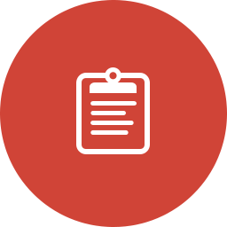
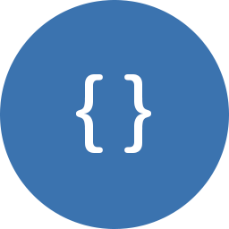

# Atlassian Connect

Atlassian Connect enables building and delivering add-ons for Atlassian applications. Connect add-ons operate under HTTP and REST APIs.

    

        
        <h2>Getting Started</h2>
        

            Quickly get started building an add-on using this <a href="./guides/getting-started.html">quickstart guide</a>.
        

    

    

        
        <h2>Tutorials</h2>
        

            Ready to move past Hello World? Check out our list of <a href="./guides/tutorials.html">tutorials</a> to help you build exactly what you want.
        

    

    

        
        <h2>Reference</h2>
        

            Check out Connect's full list of <a href="./capabilities/">capabilities</a> and <a href="./rest/">REST APIs</a>.
        

    

## Need help?

We're always happy to help out with code or any questions you might have. The best way to get our attention is through the <a href="https://groups.google.com/forum/#!forum/atlassian-connect-dev">Atlassian Connect mailing list</a>.