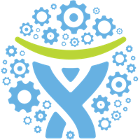

    

        
        <strong>Important</strong>
    

    You are currently browsing the _bleeding edge_ documentation for Atlassian Connect. We are determined to bring you the
    best documentation and clearest set of guidelines we can, and we're making these pre-release notes available to you
    for consideration and feedback.
    

    Please see the [Release Notes](./resources/release-notes.html) guide for a summary of recent changes to the Atlassian Connect framework.

<h1 class="index-heading">Build, install and sell add-ons in Atlassian OnDemand</h1>

    

        

            
            [<h2>Customize your product</h2>](./guides/introduction.html)
            
Build an add-on to enhance, extend or integrate your Atlassian product.

        

    

    

        

            
            [<h2>Share it with the world</h2>](./guides/selling-on-marketplace.html)
            
Share your add-on with millions of developers on the Atlassian Marketplace.

        

    

## Get Started

Start with our [Introduction to Atlassian Connect](./guides/introduction.html) and learn about the powerful ways you can
enhance your Atlassian application.

## Need help?

We're always happy to help out with any questions you might have. Check out the ways you can [Get Help](./resources/getting-help.html).
